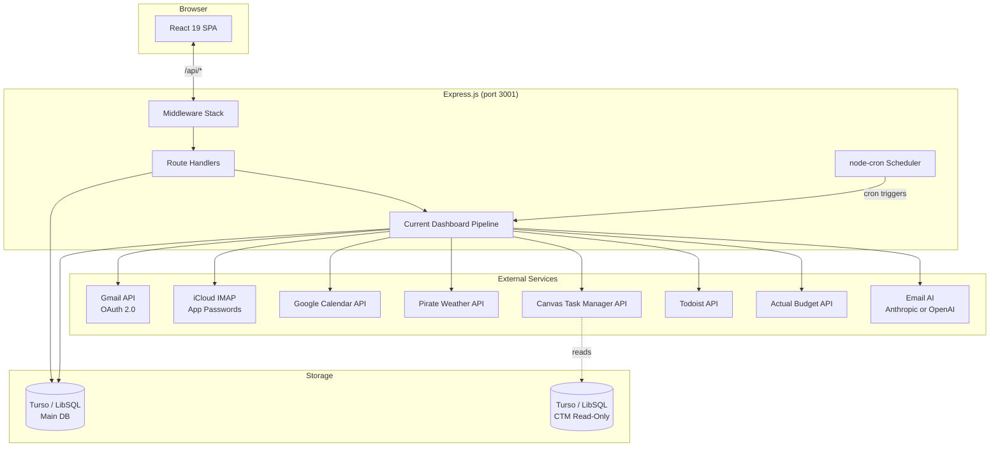
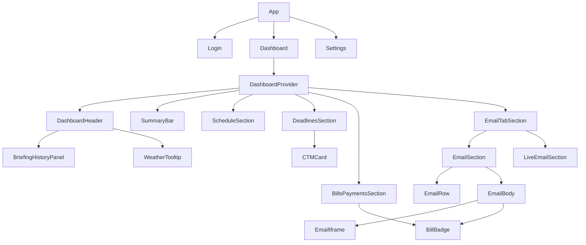
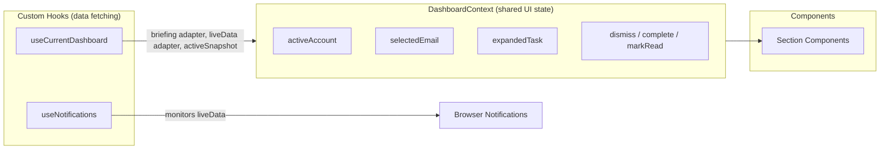
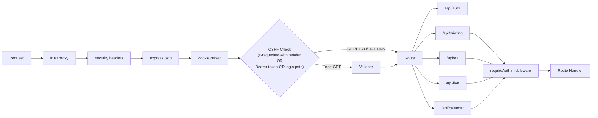
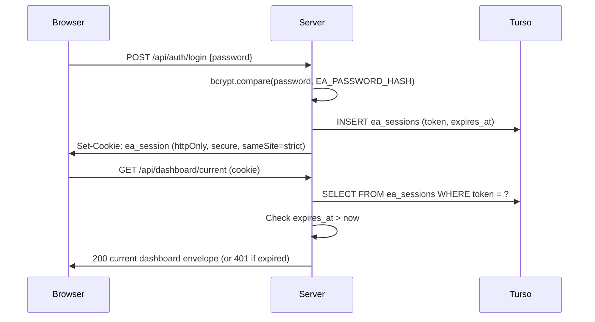
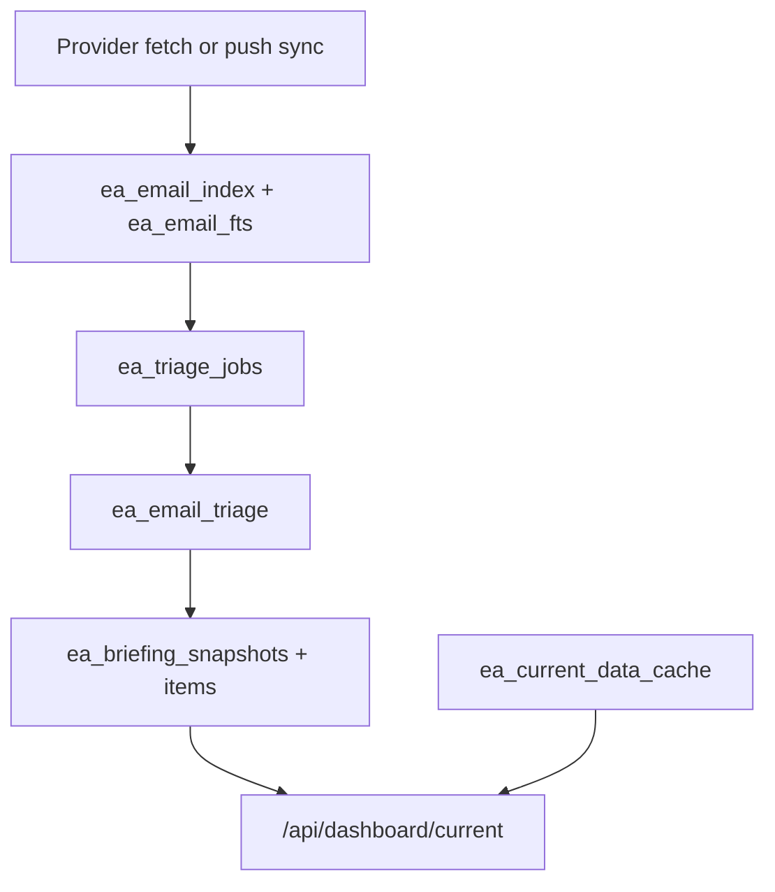

# Architecture

Personal executive assistant dashboard that consolidates emails, calendars, weather, Canvas LMS deadlines, Todoist tasks, and finances into a current operational workspace. Single-user app built with React 19 + Express.js, backed by Turso (LibSQL) and provider-backed email triage. Deployed on Render.

## System Overview



## Tech Stack

| Layer | Technology | Purpose |
|-------|-----------|---------|
| Frontend | React 19, React Router 7 | SPA with client-side routing |
| Build | Vite 8, Tailwind CSS 4 | Bundling, dev server, utility-first CSS |
| UI | shadcn/ui, Radix, Framer Motion | Component primitives, animations |
| Backend | Express 4 | HTTP API server |
| Database | Turso (LibSQL) | SQLite-compatible cloud DB |
| AI | Anthropic Messages API, OpenAI Responses API | Email triage and bill signals |
| Search | SQLite FTS5 | Full-text email search |
| Email | Gmail API, ImapFlow (iCloud) | Multi-account email fetching |
| Calendar | Google Calendar API | Event sync (reuses Gmail OAuth) |
| Weather | Pirate Weather | Forecast data |
| Tasks | CTM API, Todoist API | Academic deadlines + personal tasks |
| Finance | @actual-app/api | Budget tracking, bill management |
| Auth | bcrypt, cookie sessions | Password login, session tokens |
| Encryption | AES-256-GCM | Credentials encrypted at rest |
| Scheduling | node-cron | Snapshot boundary checks and background workers |

## Directory Map

```
ea-dashboard/
├── server/
│   ├── index.js                    # Express entry: middleware, routes, migrations, scheduler
│   ├── briefing/
│   │   ├── email-service.js        # Email read/unread/trash/snooze/dismiss, FTS search, body fetch
│   │   ├── tasks-service.js        # Complete task (CTM+Todoist), CTM status, tombstone dismiss, Todoist CRUD
│   │   ├── bills-service.js        # Actual Budget wrappers + provider-backed bill extraction
│   │   ├── dev-service.js          # Dev-only helpers (reindex emails)
│   │   ├── triage-worker.js        # Durable incoming-email triage worker
│   │   ├── triage-preflight.js     # Deterministic preflight routing before provider calls
│   │   ├── snapshot-service.js     # Active snapshot windows/items and history views
│   │   ├── bill-extract.js         # Provider-backed bill extraction from email text
│   │   ├── email-ai-models.js      # Email AI provider/model catalog and validation
│   │   ├── gmail.js                # Gmail OAuth, fetch, mark-read, trash
│   │   ├── icloud.js               # IMAP connection pool, fetch, mark-read, trash
│   │   ├── calendar.js             # Google Calendar: today/tomorrow/next-week ranges
│   │   ├── weather.js              # Pirate Weather: forecast + geocoding
│   │   ├── ctm.js                  # Canvas deadlines: fetch + status update
│   │   ├── todoist.js              # Todoist tasks: fetch + complete
│   │   ├── tombstones.js           # Hydrate completed-but-visible recurring Todoist rows
│   │   ├── snooze-waker.js         # Periodic unsnoozer: resurfaces emails past their until_ts
│   │   ├── actual.js               # Actual Budget: metadata, bills, send transactions
│   │   ├── html-to-text.js         # HTML email body → plain text for indexing/snippets
│   │   ├── email-index.js          # FTS5 email indexing for cross-account search
│   │   ├── encryption.js           # AES-256-GCM encrypt/decrypt (legacy CBC migration)
│   │   └── scheduler.js            # Cron job management with hot reload
│   ├── dashboard/
│   │   ├── current-service.js      # Current dashboard envelope from durable current cache + active snapshot
│   │   └── current-events.js       # SSE notifications for current dashboard changes
│   ├── routes/
│   │   ├── auth.js                 # Login, session check, logout (rate-limited)
│   │   ├── briefing/               # Thin HTTP handlers for email, snapshot, tasks, bills, and dev reindexing
│   │   ├── dashboard.js            # Current dashboard, current sync/refresh, health, SSE events
│   │   ├── accounts.js             # Account CRUD, Gmail OAuth, settings, schedules, API tokens
│   │   ├── calendar.js             # Read-only calendar endpoints (mounted at /api/calendar)
│   │   └── live.js                 # Retired `/api/live/all` compatibility response
│   ├── middleware/
│   │   └── auth.js                 # Session + Bearer-token validation, requireAuth middleware
│   └── db/
│       ├── connection.js           # Turso client (remote prod, local dev file)
│       ├── ctm-connection.js       # Read-only CTM database client
│       ├── migrate.js              # Sequential SQL migration runner
│       └── migrations/             # Numbered SQL files auto-run in order
├── src/
│   ├── main.jsx                    # React entry point
│   ├── App.jsx                     # Router + auth guard (3 routes)
│   ├── api.js                      # API client: apiFetch wrapper + 40 endpoint functions
│   ├── index.css                   # Tailwind v4 + CSS tokens (oklch, Catppuccin Mocha)
│   ├── pages/
│   │   ├── Dashboard.jsx           # Main page: current dashboard display, refresh gestures
│   │   ├── Settings.jsx            # Account management, config, integrations
│   │   └── Login.jsx               # Password auth with lockout
│   ├── context/
│   │   └── DashboardContext.jsx    # Email/task state, computed values, action handlers
│   ├── hooks/
│   │   ├── useCurrentDashboard.js  # Normal boot/runtime data from `/api/dashboard/current`
│   │   ├── useLiveEmailState.js    # Derived read/snoozed state for live email rows
│   │   ├── useNotifications.js     # Browser notifications for events, bills, emails
│   │   ├── useAutoRefresh.js       # Visibility-aware auto refresh helpers
│   │   ├── useHoldGesture.js       # Long-press detection (1.5s) for refresh/suspend
│   │   ├── useKeyHold.js           # Keyboard-hold state machine (powers hold gestures)
│   │   ├── useCustomize.js         # Customize-panel drag/reorder state
│   │   ├── useIsMobile.js          # Responsive breakpoint hook
│   │   ├── useMediaQuery.js        # Generic media-query matcher
│   │   ├── briefing/               # Snapshot/history compatibility hooks
│   │   └── email/                  # Smaller email-specific hooks
│   ├── components/
│   │   ├── layout/                 # Header, SummaryBar, Section, Loading, Error
│   │   ├── shell/                  # ShellHeader, CommandPalette, CustomizePanel
│   │   ├── dashboard/              # TodayTimeline and other dashboard-root pieces
│   │   ├── briefing/               # Snapshot history components
│   │   ├── email/                  # EmailTabSection, EmailSection, LiveEmail, EmailRow, Body
│   │   ├── inbox/                  # Inbox-style grouped email views
│   │   ├── calendar/               # ScheduleSection (today/tomorrow/next-week, NowMarker)
│   │   ├── deadlines/              # DeadlinesSection (merged CTM + Todoist + tombstones)
│   │   ├── ctm/                    # CTMCard (status spine), CTMSection
│   │   ├── todoist/                # AddTaskPanel and Todoist-specific UI
│   │   ├── bills/                  # BillsPaymentsSection, BillBadge (Actual Budget send)
│   │   ├── settings/               # Settings page sub-components
│   │   ├── shared/                 # SearchableDropdown, Tooltip, WeatherTooltip
│   │   └── ui/                     # shadcn primitives + MotionWrappers, BottomSheet
│   └── lib/
│       ├── utils.ts                # cn() — clsx + tailwind-merge
│       ├── actualMetadata.js       # Singleton cache for Actual Budget metadata
│       ├── dashboard-helpers.js    # Date formatting, urgency colors, greeting pools
│       ├── redesign-helpers.js     # Layout/measurement helpers for the shell redesign
│       ├── bill-utils.js           # Bill normalization and dedupe helpers
│       ├── email-links.js          # Parse/transform email links for safe rendering
│       └── icons.js / icons.jsx    # Icon registry shared across components
└── docs/                           # Local gitignored working docs, plans, references, generated snapshots
```

## Frontend Architecture

### Routing

```
/ ──────── Dashboard (auth required)
/login ─── Login
/settings ─ Settings (auth required)
```

Auth guard in `App.jsx`: `authenticated ? <Component /> : <Navigate to="/login" />`. Auth state: `null` = loading spinner, `true/false` = route.

### Component Hierarchy



### State Management

No global state library. Three layers:



**`useCurrentDashboard`** — Normal dashboard boot/runtime hook. Fetches `/api/dashboard/current`, listens to `/api/dashboard/current/events`, and exposes stable `briefingData`, `liveData`, and `activeSnapshot` adapters for the existing dashboard component tree.

**`DashboardContext`** — Shared across all dashboard sections. Derives `emailAccounts`, `billEmails`, `totalBills`, `totalNoiseCount` via `useMemo`. Provides action handlers that update both API and local state.

### Data Flow

```
GET /api/dashboard/current
  → current-service reads durable current rows + active snapshot view
  → useCurrentDashboard adapts the envelope into briefingData/liveData/activeSnapshot
  → DashboardContext derives computed values and action handlers
  → Section components render via useDashboard()
```

401 responses from any API call → automatic redirect to `/login`.

### Interactions

| Gesture | Action |
|---------|--------|
| Tap R key | Sync current dashboard data and active snapshot |
| Hold Suspend 1.5s | Suspend Render service |
| Click email | Expand EmailBody panel (iframe with sanitized HTML) |
| Click task status dot | Cycle task status (incomplete → in_progress → complete) |
| Type in Inbox search | FTS5 email keyword search across indexed INBOX mail |

## Backend Architecture

### Request Flow



### Route Groups

| Group | Mount | Endpoints | Key Responsibilities |
|-------|-------|-----------|---------------------|
| Auth | `/api/auth` | 3 | Login (rate-limited 5/15min), session check, logout |
| Briefing | `/api/briefing` | domain routers | Email ops (read/trash/snooze/dismiss), snapshots, FTS email search, task ops, Actual Budget |
| Dashboard | `/api/dashboard` | 5 | Current dashboard envelope, current refresh/sync, health, SSE change events |
| Accounts | `/api/ea` | 16 | Account CRUD, Gmail OAuth, settings, schedules, geocode, suspend, important senders, API tokens |
| Live | `/api/live` | 1 | Retired `/api/live/all` compatibility response |
| Calendar | `/api/calendar` | 1 | Read-only calendar slice exposed separately from briefing |

### Authentication



Two auth paths exist, but they no longer feed a single shared "any auth works" guard:

1. **Cookie session** — browser receives raw 32-byte hex session token, but `ea_sessions` stores only `sha256:<digest>`. Validation supports lazy migration of any legacy raw rows still present. Used by the browser SPA and required by normal dashboard routes.
2. **Bearer API token** — `Authorization: Bearer <token>` validated against `ea_api_tokens` (token hash, scopes, expiry). Used only by explicitly opted-in external integration endpoints (currently `POST /api/briefing/actual/quick-txn`). New tokens expire by default after 90 days unless overridden by env. Bearer requests are exempt from the `x-requested-with` CSRF check — they carry their own unforgeable secret.

Gmail OAuth: separate CSRF token flow (UUID, 10-min TTL, one-time use) stored in `ea_csrf_tokens`, plus a short-lived `SameSite=Lax` browser-bind cookie for callback binding.

## Current Dashboard Pipeline

The current dashboard no longer stores legacy briefing JSON. Email data flows through the durable email index, triage rows, snapshot windows/items, snooze state, dismissed-email state, and current-data cache. Weather, calendar, CTM, Todoist, bills, Actual, and notes are fetched through domain services and assembled into the `/api/dashboard/current` envelope.



### Durable Email AI

Incoming email classification is handled by `server/briefing/triage-worker.js` against durable `ea_email_triage` rows and `ea_triage_jobs`. Deterministic preflight in `triage-preflight.js` can resolve no-model, trusted-sender, weak-security, pending-security, and obvious-noise cases before provider calls. Provider-backed calls use the selected email AI provider/model from `email-ai-models.js`; bill extraction uses `bill-extract.js` and the bill extraction provider/model settings.

Email interests from settings influence classification. Scheduled payments from Actual Budget are cross-referenced during bill extraction to suppress duplicate bill detections.

Model selection is user-configurable through `/api/ea/models`, defaults to Anthropic `claude-sonnet-4-6`, and can use OpenAI `gpt-5.5`. Anthropic uses temperature `0` for format adherence; OpenAI triage uses structured Responses API output with cache-key hints where supported.

### Key Optimizations

**Durable Triage Queue** — Provider sync creates pending triage rows and deduped jobs. Workers can resume from durable rows after process restarts.

**Email Indexing & Push Ingestion** — All fetched emails (read + unread) are persisted to `ea_email_index` with an FTS5 virtual table for cross-account keyword search. Gmail accounts can register an INBOX Pub/Sub watch through `GMAIL_PUBSUB_TOPIC`; `/api/gmail/push` decodes the Pub/Sub envelope, queues an account-level `gmail_history_sync` job, and returns quickly. The history-sync worker uses the stored Gmail `last_history_id` cursor to fetch new INBOX messages, index them, create pending durable triage rows, and enqueue message-level `email_triage` jobs. The 2-hour background indexer remains a reconciliation path for missed push events, downtime, watch expiry, and iCloud polling. Historical completeness is handled separately by the resumable INBOX backfill worker, which defaults to 365 days, scans fixed 7-day windows newest-to-oldest, and records per-account state in `ea_email_backfill_state`.

**Current Data Cache** — Non-email boot-critical data is cached by user and cache key, with health metadata exposed in the current dashboard envelope.

## Data Sources

| Source | Module | API | Auth | Error Fallback |
|--------|--------|-----|------|----------------|
| Gmail | `server/briefing/gmail.js` | Gmail REST API | OAuth 2.0 (auto-refresh tokens) | Empty array, continue |
| iCloud | `server/briefing/icloud.js` | IMAP (imap.mail.me.com:993) | App-specific password | Empty array, continue |
| Calendar | `server/briefing/calendar.js` | Google Calendar API | Reuses Gmail OAuth | Empty array, continue |
| Weather | `server/briefing/weather.js` | Pirate Weather | API key | Cached data or placeholder |
| CTM | `server/briefing/ctm.js` | Custom REST API | Bearer token | Empty array, continue |
| Todoist | `server/briefing/todoist.js` | Todoist REST v1 | Bearer token (encrypted) | Empty array, continue |
| Actual Budget | `server/briefing/actual.js` | @actual-app/api SDK | Server URL + password (encrypted) | Empty array, continue |
| Email triage AI | `server/briefing/triage-worker.js` | Anthropic Messages API or OpenAI Responses API | Provider API key | Durable job remains retryable or falls back by mode |
| Bill extraction AI | `server/briefing/bill-extract.js` | Anthropic Messages API or OpenAI Responses API | Provider API key | Bill extraction returns no bill signal |
All data source failures are caught individually — one source going down never blocks the current dashboard. Email triage and bill extraction failures are isolated to durable jobs or the specific bill-signal request.

## Database Schema

```mermaid
erDiagram
    ea_accounts {
        text id PK "email or icloud-prefix"
        text user_id
        text type "gmail | icloud"
        text email
        text label
        text color
        text icon
        int calendar_enabled
        text credentials_encrypted "AES-256-GCM"
        int sort_order
        datetime created_at
        datetime updated_at
    }

    ea_settings {
        text user_id PK
        text schedules_json "cron schedule array"
        int email_lookback_hours
        real weather_lat
        real weather_lng
        text weather_location
        text actual_budget_url
        text actual_budget_password_encrypted
        text actual_budget_sync_id
        text email_ai_provider
        text email_ai_model
        text email_interests_json
        text todoist_api_token_encrypted
        text important_senders_json
        datetime created_at
    }

    ea_sessions {
        text token PK "32-byte hex"
        int expires_at "Unix ms, 30-day TTL"
        datetime created_at
    }

    ea_csrf_tokens {
        text token PK "UUID"
        text account_label
        int expires_at "Unix ms, 10-min TTL"
        datetime created_at
    }

    ea_dismissed_emails {
        text user_id PK
        text email_id PK
        datetime dismissed_at
    }

    ea_completed_tasks {
        text user_id PK
        text todoist_id PK
        text due_date "snapshot due for visibility window"
        text snapshot_json "JSON of last-known task for render after source drop"
        datetime completed_at
    }

    ea_snoozed_emails {
        text user_id PK
        text email_id PK
        int until_ts "Unix ms; snooze-waker resurfaces when passed"
        text email_snapshot
        text snoozed_at
    }

    ea_api_tokens {
        int id PK
        text token_hash UK "hash-only; raw token shown once on create"
        text label
        text scopes "CSV or JSON of permitted scopes"
        int created_at
        int last_used_at
        int expires_at
    }

    ea_email_index {
        text uid PK "gmail-acct-id or icloud-id"
        text user_id
        text account_id
        text account_label
        text account_email
        text account_color
        text account_icon
        text from_name
        text from_address
        text subject
        text body_snippet "short UI preview"
        text body_text "full plain-text body for FTS"
        text email_date
        int read
        datetime indexed_at
    }

    ea_email_backfill_state {
        text user_id PK
        text account_id PK
        text mailbox_scope PK "inbox"
        text status "queued/running/retry/paused/completed"
        int target_days
        text oldest_target_date
        text oldest_indexed_date
        text last_scanned_at
        text cursor_json "current window/page cursor"
        int indexed_count
        text last_error
        int attempts
        text started_at
        text completed_at
        text updated_at
    }

    ea_gmail_watch_state {
        text user_id
        text account_id
        text email_address
        text last_history_id "Gmail history cursor"
        text watch_expiration_at
        text watch_status "active/inactive/error"
        text last_notification_at
        text last_renewed_at
        text last_sync_at
        text last_error
    }

    ea_triage_jobs {
        text user_id
        text account_id
        text email_id "nullable for account-level jobs"
        text job_type "gmail_history_sync/email_triage"
        text status "queued/running/complete/failed"
        text idempotency_key
        int priority
        int attempts
        text payload_json
        text locked_at
        text last_error
        text scheduled_for
        text completed_at
    }

    ea_email_fts {
        text uid "UNINDEXED join key"
        text from_name "FTS5 indexed"
        text from_address "FTS5 indexed"
        text subject "FTS5 indexed"
        text body_snippet "FTS5 indexed"
        text body_text "FTS5 indexed (full body)"
    }

```



### Migrations

Sequential SQL files in `server/db/migrations/`, auto-run on server start:

| # | File | Purpose |
|---|------|---------|
| 1 | `001_ea_tables.sql` | Core tables: accounts, legacy briefings, settings |
| 2 | `002_account_calendar_flag.sql` | `calendar_enabled` on accounts |
| 3 | `003_account_icon.sql` | `icon` column on accounts |
| 4 | `004_claude_model.sql` | Retired `claude_model` setting added for older databases |
| 5 | `005_briefing_progress.sql` | `progress` column for polling |
| 6 | `006_email_interests.sql` | `email_interests_json` on settings |
| 7 | `007_dismissed_emails.sql` | `ea_dismissed_emails` table |
| 8 | `008_sessions.sql` | `ea_sessions` + `ea_csrf_tokens` tables |
| 9 | `009_embeddings.sql` | Legacy retired embeddings table; no active routes or writes |
| 10 | `010_account_sort_order.sql` | `sort_order` on accounts |
| 11 | `011_important_senders.sql` | `important_senders_json` on settings |
| 12 | `012_gmail_user_index.sql` | `gmail_index` on accounts |
| 13 | `013_todoist_settings.sql` | `todoist_api_token_encrypted` on settings |
| 14 | `014_completed_tasks.sql` | `ea_completed_tasks` table |
| 15 | `015_account_user_index.sql` | Index `ea_accounts(user_id)` |
| 16 | `016_email_search_index.sql` | `ea_email_index` + `ea_email_fts` (FTS5) |
| 17 | `017_drop_gmail_index.sql` | Drop obsolete `gmail_index` column (Gmail now uses `?authuser=`) |
| 18 | `018_dedupe_email_fts.sql` | Clean up duplicate rows in `ea_email_fts` |
| 19 | `019_email_body_text.sql` | Add `body_text` to index + rebuild FTS with new column |
| 20 | `020_pinned_emails.sql` | Legacy retired pin table; no active routes or writes |
| 21 | `021_api_tokens.sql` | `ea_api_tokens` table — Bearer-auth for external integrations |
| 22 | `022_pinned_emails_snapshot.sql` | Legacy retired pin snapshot column; migration retained for existing databases |
| 23 | `023_snoozed_emails.sql` | `ea_snoozed_emails` + index on `(user_id, until_ts)` |
| 24 | `024_snoozed_resurfaced.sql` | Track snooze resurface state |
| 25 | `025_completed_tasks_metadata.sql` | Add `due_date` + `snapshot_json` to `ea_completed_tasks` |
| 26 | `026_bill_extract_model.sql` | Configurable bill extraction provider/model |
| 27 | `027_notes.sql` | Local notes table |
| 28 | `028_csrf_browser_bind.sql` | OAuth browser-binding metadata |
| 29 | `029_email_backfill_state.sql` | Durable per-account email backfill state |
| 30 | `030_triage_snapshots.sql` | Durable email triage, snapshot windows/items, triage jobs/rules/feedback |
| 31 | `031_gmail_watch_state.sql` | Gmail Pub/Sub watch state and history cursor |
| 32 | `032_email_ai_model.sql` | Current email AI provider/model settings |
| 33 | `033_email_triage_mode.sql` | Email triage mode setting |
| 34 | `034_current_data_cache.sql` | Durable current data cache |
| 35 | `035_todoist_mirror.sql` | Todoist mirror tables |
| 36 | `036_snapshot_item_source_metadata.sql` | Snapshot item source metadata |
| 37 | `037_todoist_webhook_deliveries.sql` | Todoist webhook delivery ledger |
| 38 | `038_todoist_oauth_tokens.sql` | Todoist OAuth token fields |
| 39 | `039_align_email_fts_rowids.sql` | Align email FTS rowids with indexed email rows |
| 40 | `040_todoist_health_correctness.sql` | Todoist health metadata |
| 41 | `041_current_data_health_correctness.sql` | Current data health metadata |
| 42 | `042_snapshot_history_labels.sql` | Snapshot schedule labels |
| 43 | `043_email_triage_decision_metadata.sql` | Email triage decision metadata |
| 44 | `044_legacy_briefing_cleanup.sql` | Drop legacy briefing storage and retired settings column |

## Key Patterns

### Current Dashboard Runtime

Manual generation and status polling are retired. The active dashboard is served from current snapshot, triage, cache, and provider-domain tables; migration `044_legacy_briefing_cleanup.sql` removes the old `ea_briefings`, `ea_embeddings`, and `ea_pinned_emails` storage after a rollback-only Turso export.

### Encryption at Rest

All stored credentials use AES-256-GCM with a single `EA_ENCRYPTION_KEY`. Format: `gcm:iv:ciphertext:authTag`. Legacy CBC-encrypted values (`iv:ciphertext`) are transparently decrypted and re-encrypted as GCM on next write.

### Graceful Degradation

Current-data fetches degrade independently. A Gmail outage can leave the snapshot stale or empty while calendar, weather, deadlines, bills, and provider health still render from live fetches or cache. Email triage and bill extraction failures are isolated to their durable job/request paths and do not block dashboard boot.

### Connection Pooling

- **iCloud IMAP**: Persistent connections per email address with 10-minute idle TTL. Reused across fetches, auto-reconnect on loss.
- **Actual Budget**: Singleton API instance with mutex lock. Serial access prevents contention from the SDK's single-connection design.
- **Gmail**: Token refresh on-demand before each API call (5-minute expiry buffer).

### Floating Panel Pattern

All dropdowns, popovers, and panels use:
1. `createPortal(..., document.body)` — escape parent DOM tree
2. `position: fixed` with coords from `getBoundingClientRect()`
3. `overscrollBehavior: contain` + wheel boundary prevention
4. `isolation: isolate` + opaque background (`#16161e`)
5. Click-outside via `pointerdown` on `document`

Reference implementations: `BriefingHistoryPanel.jsx`, `src/components/shared/pickers/AnchoredFloatingPanel.jsx`.

### Scheduler

Database-driven cron jobs via `node-cron`. Schedules stored as JSON array in `ea_settings.schedules_json`. Each entry: `{ label, time, tz, enabled, skipped_until? }`. Hot-reloaded on settings update (all jobs cleared and recreated). Schedule ticks advance the active email snapshot boundary through `snapshot-service`; they do not run a batch generator. Skip functionality sets `skipped_until` to midnight tomorrow in the schedule's timezone.

### Recurring Todoist Tombstones

When a recurring Todoist task is completed, the Todoist API advances it to the next occurrence and the prior instance disappears from the live list. That would make the dashboard row flicker out before the user's "completed" strikethrough animation finishes.

`server/briefing/tombstones.js`'s `hydrateRecurringTombstones(userId, todoistTaskIdSet)` compensates: it reads `ea_completed_tasks` entries whose `due_date` is still within the visibility window and whose `todoist_id` is no longer in the live set, then emits synthetic task rows rebuilt from `snapshot_json` (migration 025). The orchestrator merges these with the separated Todoist list so the completed instance keeps rendering until its due date falls off the window. `DeadlinesSection` treats tombstoned rows specially to avoid shared-id collisions (see recent commits `217286f`, `eb17d23`).

### Snooze

`ea_snoozed_emails` holds `(user_id, email_id, until_ts, email_snapshot)`. `server/briefing/snooze-waker.js` runs periodically; when `until_ts` has passed it re-injects the email into the live feed using the stored snapshot (so the email stays visible even if it's already been fetched-and-filed in the underlying mailbox).

## API Reference

### Auth

| Method | Path | Auth | Purpose |
|--------|------|------|---------|
| POST | `/api/auth/login` | No | Password login (rate-limited 5/15min) |
| GET | `/api/auth/check` | Cookie | Session validation |
| POST | `/api/auth/logout` | Cookie | Destroy session |

### Briefing Namespace

The `/api/briefing` namespace now contains operational subroutes for inbox, snapshot, task, bill, and dev-reindex actions. Retired lifecycle routes such as `/api/briefing/latest`, `/api/briefing/history`, `/api/briefing/generate`, `/api/briefing/status/:id`, and `/api/briefing/:id` are not mounted.

### Current Dashboard

| Method | Path | Purpose |
|--------|------|---------|
| GET | `/api/dashboard/current` | Normal dashboard boot/runtime envelope from durable current-data cache plus active snapshot |
| POST | `/api/dashboard/current/refresh` | Light background refresh of current rows |
| POST | `/api/dashboard/current/sync` | Explicit bounded sync of current rows plus active snapshot fallback |
| GET | `/api/dashboard/health` | Authenticated system/provider health shape |
| GET | `/api/dashboard/current/events` | SSE notifications when current dashboard data changes |

The current dashboard envelope is the production runtime contract. It includes weather, calendar, deadlines, bills, `providerHealth`/`systemStatus`, and the active snapshot inbox view. Non-email boot-critical data is stored in the durable current-data cache keyed by `user_id` and cache key; email rows come from active snapshot/domain tables, not from `ea_briefings.briefing_json`.

### Email Search

| Method | Path | Purpose |
|--------|------|---------|
| GET | `/api/briefing/email-search?q=` | FTS5 keyword search for the Inbox tab across indexed INBOX mail |
| GET | `/api/briefing/email-index/health` | Production-available index/backfill health by account |
| POST | `/api/briefing/email-index/backfill` | Queue/resume historical INBOX backfill and wake the worker |

Search contract:

- Email search queries `ea_email_fts` joined to `ea_email_index`; it is not limited to the latest briefing JSON or live polling payload.
- Current historical completeness target is INBOX mail only. Archived, sent, trash, and provider-wide all-mail history are intentionally out of scope.
- The default historical backfill target is 365 days. This is minimum desired coverage, not a retention cutoff.
- Indexed rows are not pruned by default. Older rows can remain searchable.
- Stale rows can remain searchable if a provider message later leaves INBOX or is deleted. Provider reconciliation/deletion cleanup is not part of the current contract.

Operational runbook:

```bash
# Check indexed coverage and backfill state by account.
curl -s https://<app-host>/api/briefing/email-index/health \
  -H 'Cookie: ea_session=<session>'

# Queue/resume the default 365-day INBOX backfill and wake the worker.
curl -s -X POST https://<app-host>/api/briefing/email-index/backfill \
  -H 'Cookie: ea_session=<session>' \
  -H 'Content-Type: application/json' \
  -d '{}'

# Optional shorter diagnostic target.
curl -s -X POST https://<app-host>/api/briefing/email-index/backfill \
  -H 'Cookie: ea_session=<session>' \
  -H 'Content-Type: application/json' \
  -d '{"targetDays":90}'
```

Health responses intentionally avoid email bodies. Use `indexed_count`, `oldest_indexed_date`, `newest_indexed_date`, `last_indexed_at`, `backfill.status`, `backfill.current_window`, `backfill.attempts`, and `backfill.last_error` to diagnose coverage or stuck accounts. `paused` generally means auth/rate-limit intervention is needed; `retry` means the worker can resume a transient failure.

### Email Operations

| Method | Path | Purpose |
|--------|------|---------|
| GET | `/api/briefing/email/:uid` | Fetch full email body |
| POST | `/api/briefing/email/:uid/mark-read` | Mark email as read in source |
| POST | `/api/briefing/email/:uid/trash` | Move email to trash |
| POST | `/api/briefing/email/mark-all-read` | Batch mark as read |
| POST | `/api/briefing/dismiss/:emailId` | Permanently dismiss email |
| POST | `/api/briefing/email/:uid/snooze` | Snooze email until `until_ts` |
| DELETE | `/api/briefing/email/:uid/snooze` | Cancel snooze and resurface |

Exact paths drift; the source of truth is `server/routes/briefing/*.js` (per-domain sub-routers: `email.js`, `email-index.js`, `snapshot.js`, `tasks.js`, `bills.js`, and `dev.js`, all composed by `index.js`). Route handlers stay thin; business logic and DB access live in `server/briefing/*-service.js` and current worker modules.

### Tasks

| Method | Path | Purpose |
|--------|------|---------|
| POST | `/api/briefing/complete-task/:taskId` | Complete task (Todoist + CTM) |
| PATCH | `/api/briefing/task-status/:taskId` | Update CTM task status |

### Actual Budget

| Method | Path | Purpose |
|--------|------|---------|
| POST | `/api/briefing/actual/send` | Send bill as transaction |
| GET | `/api/briefing/actual/metadata` | Accounts + categories + payees |
| GET | `/api/briefing/actual/accounts` | Account list |
| GET | `/api/briefing/actual/payees` | Payee list |
| GET | `/api/briefing/actual/categories` | Category tree |
| POST | `/api/briefing/actual/test` | Test connection |

### Accounts & Settings

| Method | Path | Purpose |
|--------|------|---------|
| GET | `/api/ea/accounts` | List all accounts |
| GET | `/api/ea/accounts/gmail/auth` | Generate OAuth consent URL |
| GET | `/api/ea/accounts/gmail/callback` | OAuth redirect handler (no auth) |
| POST | `/api/ea/accounts/icloud` | Add iCloud account |
| PATCH | `/api/ea/accounts/:id` | Update account |
| DELETE | `/api/ea/accounts/:id` | Delete account |
| POST | `/api/ea/accounts/test/:id` | Test account connection |
| PATCH | `/api/ea/accounts/reorder` | Reorder accounts |
| GET | `/api/ea/settings` | Fetch all settings |
| PUT | `/api/ea/settings` | Update settings |

### Gmail Push

| Method | Path | Purpose |
|--------|------|---------|
| POST | `/api/gmail/push` | Pub/Sub webhook; requires `GMAIL_PUBSUB_PUSH_TOKEN`, decodes Gmail `emailAddress`/`historyId`, and queues `gmail_history_sync` |
| POST | `/api/ea/schedules/skip` | Skip scheduled snapshot boundary |
| GET | `/api/ea/models` | Available email AI providers and models |
| GET | `/api/ea/geocode` | Location string to lat/lng |
| POST | `/api/ea/suspend` | Suspend Render service |
| GET | `/api/ea/important-senders` | Get important senders |
| PUT | `/api/ea/important-senders` | Update important senders |

### Live Data

| Method | Path | Purpose |
|--------|------|---------|
| GET | `/api/live/all` | Retired; authenticated callers receive 410 and should use `/api/dashboard/current` |

### Calendar

| Method | Path | Purpose |
|--------|------|---------|
| GET | `/api/calendar` | Read-only calendar slice (today/tomorrow/next-week) exposed outside the briefing envelope |

### API Tokens (Bearer auth)

Token management endpoints live under `/api/auth`. Bearer tokens authenticate by `Authorization: Bearer <token>` and bypass the `x-requested-with` CSRF check, but they are not general dashboard auth. They are accepted only on explicitly opted-in automation endpoints, currently `POST /api/briefing/actual/quick-txn`. Raw tokens are shown once on creation; only `token_hash` is persisted, and new tokens receive a default 90-day expiry.

## Deployment

**Hosting:** Render (inferred from OAuth redirect URI and `RENDER_*` env vars)

**Build flow:**
1. `npm run build` → Vite produces `dist/`
2. `npm start` → Express serves `dist/` as static files with SPA fallback
3. API routes served on same process/port

**Dev flow:**
1. `npm run dev` → concurrently runs Vite (HMR) + Express (--watch)
2. Vite proxies `/api/*` to Express on port 3001

**Environment variables:** See `.env.example` for full reference. Key secrets: `EA_PASSWORD_HASH` (bcrypt), `EA_ENCRYPTION_KEY` (AES-256), `ANTHROPIC_API_KEY`, `GOOGLE_CLIENT_ID`/`SECRET`, database tokens.

**Security defaults:** production enables HSTS + CSP + frame/referrer/permissions headers. `trust proxy` defaults to `1` only in production and can be overridden via `TRUST_PROXY`.

**Cost optimization:** `/api/ea/suspend` calls Render API to suspend the service when not in use.
