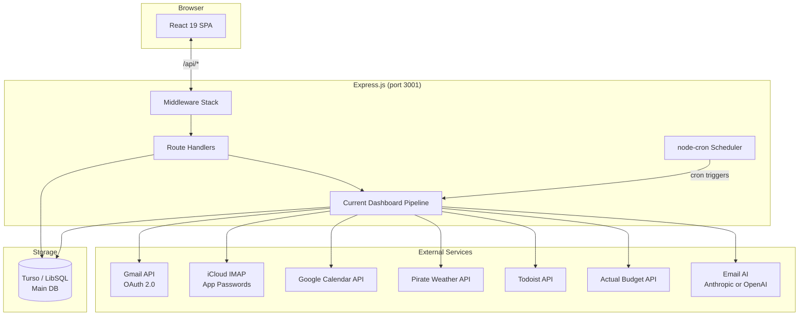
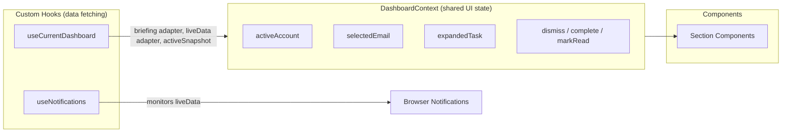
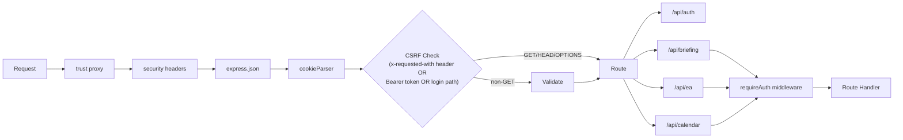
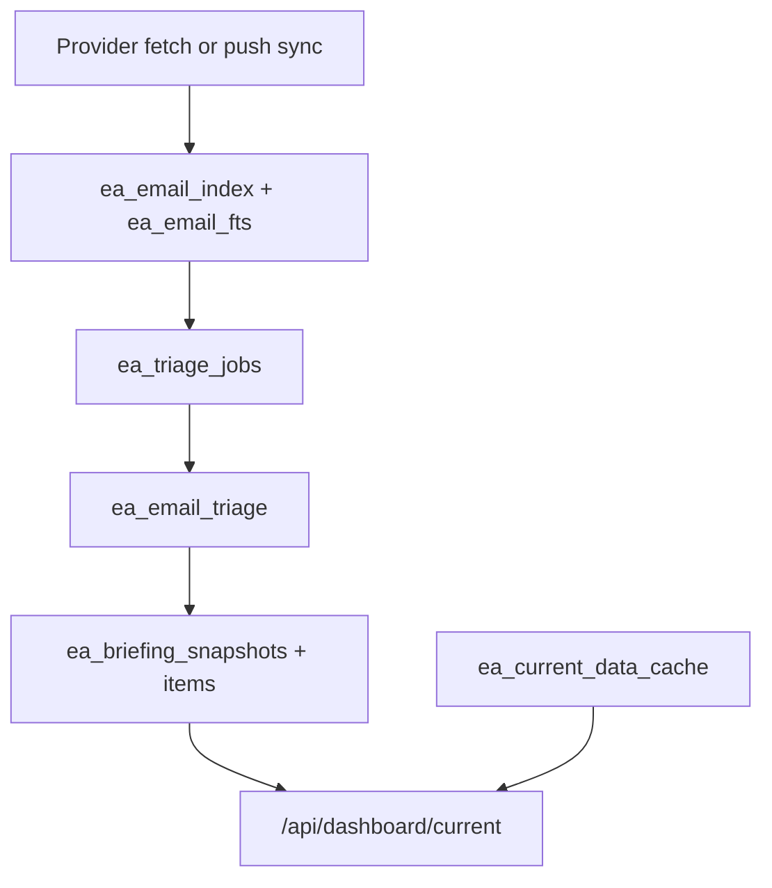

# Architecture

Personal executive assistant dashboard that consolidates emails, calendars, weather, Todoist-backed deadlines/tasks, and finances into a current operational workspace. Single-user app built with React 19 + Express.js, backed by Turso (LibSQL) and provider-backed email triage. Deployed on Render.

## System Overview



## Tech Stack

| Layer | Technology | Purpose |
|-------|-----------|---------|
| Frontend | React 19, React Router 7 | SPA with client-side routing |
| Build | Vite 8, Tailwind CSS 4 | Bundling, dev server, utility-first CSS |
| UI | shadcn/ui, Radix, Framer Motion | Component primitives, animations |
| Backend | Express 4 | HTTP API server |
| Database | Turso (LibSQL) | SQLite-compatible cloud DB |
| AI | Anthropic Messages API, OpenAI Responses API | Email triage and bill signals |
| Search | SQLite FTS5 | Full-text email search |
| Email | Gmail API, ImapFlow (iCloud) | Multi-account email fetching |
| Calendar | Google Calendar API | Event sync (reuses Gmail OAuth) |
| Weather | Pirate Weather | Forecast data |
| Tasks | Todoist API | Deadline items + personal tasks |
| Finance | @actual-app/api behind provider worker + EA mirrors | Budget tracking, bill management |
| Auth | bcrypt, WebAuthn passkeys, cookie sessions | Password-or-passkey default, optional strict mode, offline recovery |
| Encryption | AES-256-GCM | Credentials encrypted at rest |
| Scheduling | node-cron | Snapshot boundary checks and background workers |

## Directory Map

File-level detail lives in per-area `CLAUDE.md` maps (see "Area Maps" in `AGENTS.md`); this section stays at directory granularity.

Structural directory layout (depth 3 under `src/` and `server/`). Regenerated by `scripts/regen-architecture.mts` on `npm run dev` and via the `pre-commit` hook — do not hand-edit between markers.

<!-- BEGIN:tree -->
```
src/
├── auth/
├── components/
│   ├── alfred/
│   ├── bills/
│   │   └── bill-badge/
│   ├── briefing/
│   ├── calendar/
│   │   ├── events/
│   │   ├── modal/
│   │   ├── reminders/
│   │   └── views/
│   ├── dashboard/
│   │   ├── context/
│   │   ├── layout/
│   │   ├── needsYou/
│   │   ├── rails/
│   │   └── timeline/
│   ├── email/
│   ├── inbox/
│   │   ├── mobile/
│   │   ├── reader/
│   │   └── test-utils/
│   ├── layout/
│   ├── news/
│   ├── notes/
│   ├── settings/
│   │   ├── cards/
│   │   ├── sections/
│   │   └── shared/
│   ├── shared/
│   │   └── pickers/
│   ├── shell/
│   │   └── analytics/
│   ├── todoist/
│   │   └── add-task-panel/
│   └── ui/
├── context/
├── demo/
├── hooks/
│   ├── calendar/
│   ├── email/
│   └── settings/
├── lib/
├── pages/
└── test/

server/
├── actual/
├── alfred/
├── auth/
├── bills/
│   └── bill-extractors/
├── calendar/
├── dashboard/
│   └── current-providers/
├── db/
│   └── migrations/
├── email/
│   ├── search/
│   │   └── evals/
│   └── test-utils/
├── middleware/
├── news/
├── platform/
├── reminders/
├── routes/
│   └── briefing/
├── scripts/
├── snapshots/
├── tasks/
├── test-utils/
├── transactions/
└── triage/
```
<!-- END:tree -->

## Frontend Architecture

### Routing

```
/ ──────── Dashboard (auth required)
/login ─── Login
/settings ─ Settings (auth required)
```

Auth guard in `App.tsx`: `authenticated ? <Component /> : <Navigate to="/login" />`. Auth state: `null` = loading spinner, `true/false` = route.

### Component Hierarchy

<!-- TODO: rewrite during refactor. The prior diagram referenced `EmailSection`, `LiveEmailSection`, `EmailRow`, `EmailBody` which no longer exist under `src/components/email/`. Refresh once the calendar-controller decomposition (EAD-298 through EAD-302) settles. -->


The calendar modal has two top-level workspaces: Events and Bills. Deadlines are not a standalone workspace; Todoist-backed deadline items render as an Events overlay with Events-owned detail, floating-detail, create, edit, and completion flows.

### State Management

No global state library. Three layers:



**`useCurrentDashboard`** — Normal dashboard boot/runtime hook. Fetches `/api/dashboard/current`, listens to `/api/dashboard/current/events`, and exposes stable `briefingData`, `liveData`, and `activeSnapshot` adapters for the existing dashboard component tree. Event refetch scope is typed: `email_triage` reads only `/api/briefing/snapshot/active`, while every other or unknown source keeps the full-current path. Concurrent bursts coalesce to the strongest pending scope (`current` dominates), and a failed snapshot-only read falls back once to the full envelope.

**`DashboardContext`** — Shared across all dashboard sections. Derives `emailAccounts`, `billEmails`, `totalBills`, `totalNoiseCount` via `useMemo`. Provides action handlers that update both API and local state.

### Hooks

Top-level React hooks enumerated from `src/hooks/**/use*.{js,ts}` and `src/components/**/use*.{js,ts}` (test files excluded). Each entry shows the file's first exported name. Model helpers (e.g. `calendarRangeModel.ts`) live alongside hooks but are excluded from this list — they're pure modules, not React hooks.

<!-- BEGIN:hooks -->
| Export | File |
|--------|------|
| `useAlfredChat` | `src/components/alfred/useAlfredChat.ts` |
| `useBillBadgeForm` | `src/components/bills/useBillBadgeForm.ts` |
| `useCalendarEditorPickers` | `src/components/calendar/events/useCalendarEditorPickers.ts` |
| `useCalendarEventEditor` | `src/components/calendar/events/useCalendarEventEditor.ts` |
| `useCalendarEventTitleComposer` | `src/components/calendar/events/useCalendarEventTitleComposer.ts` |
| `useCalendarLocationSuggestions` | `src/components/calendar/events/useCalendarLocationSuggestions.ts` |
| `useCalendarQuickActions` | `src/components/calendar/events/useCalendarQuickActions.ts` |
| `useCalendarSources` | `src/components/calendar/events/useCalendarSources.ts` |
| `useEventRecurrenceDraft` | `src/components/calendar/events/useEventRecurrenceDraft.ts` |
| `useEventReminderDrafts` | `src/components/calendar/events/useEventReminderDrafts.ts` |
| `useCalendarGridEffects` | `src/components/calendar/modal/useCalendarGridEffects.ts` |
| `useCalendarGridOverflow` | `src/components/calendar/modal/useCalendarGridOverflow.ts` |
| `useFloatingDetailDrag` | `src/components/calendar/modal/useFloatingDetailDrag.ts` |
| `useFloatingDetailPlacement` | `src/components/calendar/modal/useFloatingDetailPlacement.ts` |
| `useCalendarGhostPreview` | `src/components/calendar/useCalendarGhostPreview.ts` |
| `useDeadlineQuickActions` | `src/components/calendar/views/deadlines/useDeadlineQuickActions.ts` |
| `useAlfredPanelState` | `src/components/dashboard/useAlfredPanelState.ts` |
| `useCalendarWorkspaceState` | `src/components/dashboard/useCalendarWorkspaceState.ts` |
| `useDashboardItemSheet` | `src/components/dashboard/useDashboardItemSheet.ts` |
| `useDashboardShellHotkeys` | `src/components/dashboard/useDashboardShellHotkeys.ts` |
| `useLiveReadOverrides` | `src/components/dashboard/useLiveReadOverrides.ts` |
| `useMobileDashboardScrollRestoration` | `src/components/dashboard/useMobileDashboardScrollRestoration.ts` |
| `useBillPayResolver` | `src/components/inbox/reader/useBillPayResolver.ts` |
| `useEmailBody` | `src/components/inbox/reader/useEmailBody.ts` |
| `useInboxActionDispatch` | `src/components/inbox/useInboxActionDispatch.ts` |
| `useInboxController` | `src/components/inbox/useInboxController.ts` |
| `useInboxKeyboardCommands` | `src/components/inbox/useInboxKeyboardCommands.ts` |
| `useInboxSessionStore` | `src/components/inbox/useInboxSessionState.ts` |
| `useInboxUndoSlot` | `src/components/inbox/useInboxUndoSlot.ts` |
| `useIndexedSearch` | `src/components/inbox/useIndexedSearch.ts` |
| `useSnapshotOptimisticOverlay` | `src/components/inbox/useSnapshotOptimisticOverlay.ts` |
| `useAddTaskPanelController` | `src/components/todoist/add-task-panel/useAddTaskPanelController.ts` |
| `useAddTaskPanelPlacement` | `src/components/todoist/add-task-panel/useAddTaskPanelPlacement.ts` |
| `useDirtyCloseConfirmation` | `src/components/todoist/add-task-panel/useDirtyCloseConfirmation.ts` |
| `useAgendaFetch` | `src/hooks/calendar/useAgendaFetch.ts` |
| `useAgendaSyncPolicy` | `src/hooks/calendar/useAgendaSyncPolicy.ts` |
| `useCalendarDeadlineOverlay` | `src/hooks/calendar/useCalendarDeadlineOverlay.ts` |
| `useCalendarDomainRange` | `src/hooks/calendar/useCalendarDomainRange.ts` |
| `useCalendarEventSelectionSet` | `src/hooks/calendar/useCalendarEventSelectionSet.ts` |
| `useCalendarFloatingDetail` | `src/hooks/calendar/useCalendarFloatingDetail.ts` |
| `useCalendarModalController` | `src/hooks/calendar/useCalendarModalController.tsx` |
| `useCalendarModalHotkeys` | `src/hooks/calendar/useCalendarModalHotkeys.ts` |
| `useCalendarModalSearch` | `src/hooks/calendar/useCalendarModalSearch.ts` |
| `useCalendarModalSelection` | `src/hooks/calendar/useCalendarModalSelection.ts` |
| `useCalendarModalViewModel` | `src/hooks/calendar/useCalendarModalViewModel.ts` |
| `useCalendarMonthNavigation` | `src/hooks/calendar/useCalendarMonthNavigation.ts` |
| `useCalendarRange` | `src/hooks/calendar/useCalendarRange.ts` |
| `useCalendarScrollSync` | `src/hooks/calendar/useCalendarScrollSync.ts` |
| `useCalendarScrollViewport` | `src/hooks/calendar/useCalendarScrollViewport.ts` |
| `useCalendarSearchActivation` | `src/hooks/calendar/useCalendarSearchActivation.ts` |
| `useDashboardDetailFocus` | `src/hooks/calendar/useDashboardDetailFocus.ts` |
| `useDashboardFocusRetry` | `src/hooks/calendar/useDashboardFocusRetry.ts` |
| `useDeadlineOverlayState` | `src/hooks/calendar/useDeadlineOverlayState.ts` |
| `useEditorCancelOnScroll` | `src/hooks/calendar/useEditorCancelOnScroll.ts` |
| `useFloatingEditorRouting` | `src/hooks/calendar/useFloatingEditorRouting.ts` |
| `usePlanningReadinessState` | `src/hooks/calendar/usePlanningReadinessState.ts` |
| `useStaleDomainCache` | `src/hooks/calendar/useStaleDomainCache.ts` |
| `useViewportWidth` | `src/hooks/calendar/useViewportWidth.ts` |
| `useInboxSelectionHistory` | `src/hooks/email/useInboxSelectionHistory.ts` |
| `useSettingsPage` | `src/hooks/settings/useSettingsPage.ts` |
| `useActiveSnapshot` | `src/hooks/useActiveSnapshot.ts` |
| `useAutoRefresh` | `src/hooks/useAutoRefresh.ts` |
| `useBrowserBackDismiss` | `src/hooks/useBrowserBackDismiss.ts` |
| `useCurrentDashboard` | `src/hooks/useCurrentDashboard.ts` |
| `useDismissablePortal` | `src/hooks/useDismissablePortal.ts` |
| `useIsMobile` | `src/hooks/useIsMobile.ts` |
| `useKeyHold` | `src/hooks/useKeyHold.ts` |
| `useMediaQuery` | `src/hooks/useMediaQuery.ts` |
| `useNews` | `src/hooks/useNews.ts` |
| `useNotifications` | `src/hooks/useNotifications.ts` |
| `useTriageNotificationSounds` | `src/hooks/useTriageNotificationSounds.ts` |
| `useUtilityPayLinks` | `src/hooks/useUtilityPayLinks.ts` |
| `useWarmImport` | `src/hooks/useWarmImport.ts` |
<!-- END:hooks -->

### Calendar Code Map

Calendar is the largest frontend feature area (~240 files). File-level maps live in `src/components/calendar/CLAUDE.md` (router for `modal/`, `events/`, `views/`, root rail files) and `src/hooks/calendar/CLAUDE.md` (hooks + pure models); server-side calendar files are mapped in `server/calendar/CLAUDE.md` and `server/routes/CLAUDE.md`.

Placement rule: new calendar hooks and models go in `src/hooks/calendar/`. Colocate a hook under `src/components/calendar/` only when it is private to one component subtree (the `events/` editor hooks are the precedent). Do not add calendar files outside these two client roots.

### Data Flow

```
GET /api/dashboard/current
  → current-service reads durable current rows + active snapshot view
  → useCurrentDashboard adapts the envelope into briefingData/liveData/activeSnapshot
  → DashboardContext derives computed values and action handlers
  → Section components render via useDashboard()
```

401 responses from any API call → automatic redirect to `/login`.

### Interactions

| Gesture | Action |
|---------|--------|
| Tap R key | Sync current dashboard data and active snapshot |
| Hold Suspend 1.5s | Suspend Render service |
| Click email | Expand EmailBody panel (iframe with sanitized HTML) |
| Click task status dot | Cycle task status (incomplete → in_progress → complete) |
| Type in Inbox search | FTS5 email keyword search across indexed INBOX mail |

## Backend Architecture

### Request Flow



### Route Groups

| Group | Mount | Endpoints | Key Responsibilities |
|-------|-------|-----------|---------------------|
| Auth | `/api/auth` | 23 | First-run owner claim, canonical-domain management, password/passkey login, recovery and step-up, passkey management, session check/logout, scoped API tokens |
| Briefing | `/api/briefing` | domain routers | Email ops (read/trash/snooze/dismiss), snapshots, FTS email search, task ops, Actual Budget |
| Dashboard | `/api/dashboard` | 5 | Current dashboard envelope, current refresh/sync, health, SSE change events |
| Accounts | `/api/ea` | 15 | Account CRUD, Gmail OAuth, settings, schedules, geocode, important senders |
| Calendar | `/api/calendar` | 1 | Read-only calendar slice exposed separately from briefing |

### Authentication

```mermaid
sequenceDiagram
    participant B as Browser
    participant S as Server
    participant DB as Turso

    B->>S: GET /api/auth/setup/status
    alt Instance is unclaimed
        B->>S: POST /api/auth/setup/claim {password, canonicalOrigin}
        S->>S: Generate stable owner UUID and bcrypt hash
        S->>DB: Atomically INSERT OR IGNORE ea_owner + confirmed ea_instance_metadata
        S->>DB: INSERT ea_sessions (hashed token, expires_at)
        S->>B: Set-Cookie: ea_session; close public setup
    end

    B->>S: POST /api/auth/login {password}
    S->>DB: SELECT password_hash FROM ea_owner singleton
    S->>S: bcrypt.compare(password, stored password_hash)
    alt Default password-or-passkey mode
        S->>DB: INSERT ea_sessions (token, expires_at)
        S->>B: Set-Cookie: ea_session (httpOnly, secure, sameSite=strict)
    else Explicit password-plus-passkey mode
        S->>DB: INSERT ea_pending_auth (10-min pending password auth)
        S->>B: Set-Cookie: ea_pending_auth (httpOnly, secure, sameSite=strict)
        B->>S: POST /api/auth/passkey/authentication/options
        S->>DB: INSERT ea_webauthn_challenges
        S->>B: WebAuthn authentication options
        B->>S: POST /api/auth/passkey/authentication/verify
        S->>DB: Consume challenge and update passkey usage
        S->>DB: INSERT ea_sessions (token, expires_at)
        S->>B: Set-Cookie: ea_session, clear ea_pending_auth
    end

    B->>S: GET /api/dashboard/current (cookie)
    S->>DB: SELECT FROM ea_sessions WHERE token = ?
    S->>S: Check expires_at > now
    S->>B: 200 current dashboard envelope (or 401 if expired)
```

The browser auth model has six distinct states:

1. **Unclaimed Instance** - no `ea_owner` singleton row. Only static/setup auth routes and `GET /healthz` are available; provider APIs and all background workers are gated.
2. **Authenticated Session** - `ea_session` cookie. The browser receives a raw 32-byte hex session token, but `ea_sessions` stores only `sha256:<digest>`. Used by the SPA and required by normal dashboard routes. Once issued, it is trusted until expiry or logout; the app does not prompt for passkey on every request.
3. **Pending Passkey Authentication** - `ea_pending_auth` cookie plus a row in `ea_pending_auth`. Created after a correct password in explicit strict mode, or when default-mode passwordless passkey login begins. It can request and verify WebAuthn options but cannot access dashboard routes.
4. **Registered Passkey** - row in `ea_passkey_credentials` containing credential ID, public key, sign count, label, transports, backup state, and device type. Public key material never leaves the server in management responses.
5. **Recent Authentication** - the authenticated session's `authenticated_at` is within ten minutes. Required for password, passkey, recovery-code, auth-mode, canonical-domain, and powerful API-token changes.
6. **Recovery or Operator Reset** - one offline recovery code can replace credentials in-app; the local `npm run auth:reset-passkeys -- --confirm` path remains the last-resort operator reset.

Ownership is database-backed in the singleton `ea_owner` row. Fresh claims rely on
the singleton primary-key invariant so exactly one concurrent insert succeeds.
Existing `EA_USER_ID` plus `EA_PASSWORD_HASH` values are an optional startup
compatibility source: startup imports the exact pair when no owner exists and
fails closed for partial or conflicting state.

Two credential paths exist, but they no longer feed a single shared "any auth works" guard:

1. **Cookie session** - normal dashboard access after password, passwordless passkey, strict password-plus-passkey, or successful recovery.
2. **Scoped API token** - `Authorization: Bearer <token>` validated against `ea_api_tokens` (token hash, scopes, expiry). Used only by explicitly opted-in external integration endpoints (currently `POST /api/briefing/actual/quick-txn`). New tokens expire by default after 90 days unless overridden by env. Bearer requests are exempt from the `x-requested-with` CSRF check because they carry their own unforgeable secret.

Production WebAuthn configuration prefers the persisted canonical HTTPS origin, deriving RP name `Setpoint`, RP ID from its hostname, and the exact expected origin. Compatible legacy `EA_WEBAUTHN_*` and `GOOGLE_REDIRECT_URI` values import only when they resolve to one origin; otherwise the explicit values remain compatibility fallbacks. Development defaults remain `Setpoint`, `localhost`, and `http://localhost:5173`.

Gmail OAuth: separate CSRF token flow (UUID, 10-min TTL, one-time use) stored in `ea_csrf_tokens`, plus a short-lived `SameSite=Lax` browser-bind cookie for callback binding.

## Current Dashboard Pipeline

Email data flows through the durable email index, triage rows, snapshot windows/items, snooze state, dismissed-email state, and current-data cache. Weather, calendar, Todoist deadlines/tasks, bills, Actual, and notes are fetched through domain services and assembled into the `/api/dashboard/current` envelope.



### Durable Email AI

Incoming email classification is handled by `server/triage/triage-worker.ts` against durable `ea_email_triage` rows and `ea_triage_jobs`. Deterministic preflight in `triage-preflight.ts` can resolve no-model, trusted-sender, weak-security, pending-security, and obvious-noise cases before provider calls. Provider-backed calls use the selected email AI provider/model from `email-ai-models.ts`; bill extraction uses `bill-extract.ts` and the bill extraction provider/model settings.

Email interests from settings influence classification. Scheduled payments from Actual Budget are cross-referenced during bill extraction to suppress duplicate bill detections.

Model selection is user-configurable through `/api/ea/models`, defaults to Anthropic `claude-sonnet-4-6`, and can use OpenAI `gpt-5.5`. Anthropic uses temperature `0` for format adherence; OpenAI triage uses structured Responses API output with cache-key hints where supported.

### Key Optimizations

**Durable Triage Queue** — Provider sync creates pending triage rows and deduped jobs. Workers can resume from durable rows after process restarts. Arrival-grace jobs retain their 30-second durable `scheduled_for`; successful writes also arm one process-local earliest-deadline wake-up so healthy processes do not add cron-boundary jitter. The unchanged 30-second cron remains the restart and missed-timer fallback.

**Email Indexing & Push Ingestion** — All fetched emails (read + unread) are persisted to `ea_email_index` with an FTS5 virtual table for cross-account keyword search. Gmail accounts can register an INBOX Pub/Sub watch through `GMAIL_PUBSUB_TOPIC`; `/api/gmail/push` decodes the Pub/Sub envelope, queues an account-level `gmail_history_sync` job, acknowledges promptly, and requests an immediate coalesced history drain. The per-minute history cron remains durable recovery. The history-sync worker uses the stored Gmail `last_history_id` cursor to fetch new INBOX messages, index them, create pending durable triage rows, and enqueue message-level `email_triage` jobs. The 2-hour background indexer remains a reconciliation path for missed push events, downtime, watch expiry, and iCloud polling. Historical completeness is handled separately by the resumable INBOX backfill worker, which defaults to 365 days, scans fixed 7-day windows newest-to-oldest, and records per-account state in `ea_email_backfill_state`.

**Scheduler Lifecycle & Timing Evidence** — Scheduler-owned cron callbacks, timers, immediates, and worker drains enter a shared work registry. Shutdown closes admission sources first and then awaits all admitted work; the process shutdown timeout remains the outer bound. Gmail history completion emits content-free `[EA Timing]` stages for provider delivery, durable queue wait, sync/index work, and snapshot attachment. Dashboard event refetches emit receipt-to-accepted-state duration with the selected `active_snapshot` or `current` scope. Invalid timestamps omit dependent durations, and no timing path changes queue completion or state-application behavior.

**Current Data Cache** — Non-email boot-critical data is cached by user and cache key, with health metadata exposed in the current dashboard envelope.

## News Tab

The fifth shell tab: RSS/Atom headlines only, no AI classification or summarization, $0 running cost. Migration `026_news.sql` adds `ea_news_topics` (owner-named topic sections), `ea_news_sources` (per-topic feed rows; `kind='hn'` sources build their `hnrss.org` URL from `hn_query`/`min_points` instead of storing one), and `ea_news_items` (a rolling window keyed unique on `(source_id, guid)`, plus `ea_settings.news_last_seen_at` for the single seen-marker); `029_news_retry_after.sql` adds durable provider retry windows. `server/news/news-poller.ts` is an in-process interval worker (mirrors the `bills-mirror-sync`/`calendar-search-mirror` pattern): a 20-minute sweep does conditional-GET fetches (`ETag`/`Last-Modified`, 10s timeout), parses with `rss-parser`, upserts items, self-heals redirected feed URLs, and backs a source off to a ~6h retry cadence after 5 consecutive failures. Reddit 429s pause the shared Reddit host until the provider's persisted `Retry-After` expires, with six hours as the fallback. Retention keeps the newest 30 items per source and additionally deletes anything older than 14 days beyond that. `server/routes/news.ts` exposes the page payload (`GET /api/news`), topic/source CRUD, starter-catalog import, an add-source preview endpoint (fetches the pasted URL and follows one autodiscovered `<link rel=alternate>` if it isn't already a feed), the seen-marker bump, and a debounced manual refresh.

## Data Sources

| Source | Module | API | Auth | Failure Behavior |
|--------|--------|-----|------|----------------|
| Gmail | `server/email/gmail.ts` | Gmail REST API | OAuth 2.0 (auto-refresh tokens) | Empty array, continue |
| iCloud | `server/email/icloud.ts` | IMAP (imap.mail.me.com:993) | App-specific password | Empty array, continue |
| Calendar | `server/calendar/calendar.ts` | Google Calendar API | Reuses Gmail OAuth | Empty array, continue |
| Weather | `server/platform/weather.ts` | Pirate Weather | API key | Cached data or placeholder |
| Todoist | `server/tasks/todoist.ts` | Todoist REST v1 | Bearer token (encrypted) | Empty array, continue |
| Actual Budget | `server/actual/actual.ts` + `server/bills/bills-service.ts` mirrors | @actual-app/api SDK in persistent worker | Server URL + password (encrypted) | Mirrored data, degraded sync health |
| Email triage AI | `server/triage/triage-worker.ts` | Anthropic Messages API or OpenAI Responses API | Provider API key | Durable job remains retryable or falls back by mode |
| Bill extraction AI | `server/bills/bill-extract.ts` | Anthropic Messages API or OpenAI Responses API | Provider API key | Bill extraction returns no bill signal |
All data source failures are caught individually — one source going down never blocks the current dashboard. Email triage and bill extraction failures are isolated to durable jobs or the specific bill-signal request.

## Database Schema

```mermaid
erDiagram
    ea_accounts {
        text id PK "email or icloud-prefix"
        text user_id
        text type "gmail | icloud"
        text email
        text label
        text color
        text icon
        int calendar_enabled
        text credentials_encrypted "AES-256-GCM"
        int sort_order
        datetime created_at
        datetime updated_at
    }

    ea_settings {
        text user_id PK
        text schedules_json "cron schedule array"
        int email_lookback_hours
        real weather_lat
        real weather_lng
        text weather_location
        text actual_budget_url
        text actual_budget_password_encrypted
        text actual_budget_sync_id
        text email_ai_provider
        text email_ai_model
        text email_interests_json
        text todoist_api_token_encrypted
        text important_senders_json
        datetime created_at
    }

    ea_sessions {
        text token PK "32-byte hex"
        int expires_at "Unix ms, 30-day TTL"
        datetime created_at
    }

    ea_csrf_tokens {
        text token PK "UUID"
        text account_label
        int expires_at "Unix ms, 10-min TTL"
        datetime created_at
    }

    ea_dismissed_emails {
        text user_id PK
        text email_id PK
        datetime dismissed_at
    }

    ea_completed_tasks {
        text user_id PK
        text todoist_id PK
        text due_date "snapshot due for visibility window"
        text snapshot_json "JSON of last-known task for render after source drop"
        datetime completed_at
    }

    ea_snoozed_emails {
        text user_id PK
        text email_id PK
        int until_ts "Unix ms; snooze-waker resurfaces when passed"
        text email_snapshot
        text snoozed_at
    }

    ea_api_tokens {
        int id PK
        text token_hash UK "hash-only; raw token shown once on create"
        text label
        text scopes "CSV or JSON of permitted scopes"
        int created_at
        int last_used_at
        int expires_at
    }

    ea_email_index {
        text uid PK "gmail-acct-id or icloud-id"
        text user_id
        text account_id
        text account_label
        text account_email
        text account_color
        text account_icon
        text from_name
        text from_address
        text subject
        text body_snippet "short UI preview"
        text body_text "full plain-text body for FTS"
        text email_date
        int read
        datetime indexed_at
    }

    ea_email_backfill_state {
        text user_id PK
        text account_id PK
        text mailbox_scope PK "inbox"
        text status "queued/running/retry/paused/completed"
        int target_days
        text oldest_target_date
        text oldest_indexed_date
        text last_scanned_at
        text cursor_json "current window/page cursor"
        int indexed_count
        text last_error
        int attempts
        text started_at
        text completed_at
        text updated_at
    }

    ea_gmail_watch_state {
        text user_id
        text account_id
        text email_address
        text last_history_id "Gmail history cursor"
        text watch_expiration_at
        text watch_status "active/inactive/error"
        text last_notification_at
        text last_renewed_at
        text last_sync_at
        text last_error
    }

    ea_triage_jobs {
        text user_id
        text account_id
        text email_id "nullable for account-level jobs"
        text job_type "gmail_history_sync/email_triage"
        text status "queued/running/complete/failed"
        text idempotency_key
        int priority
        int attempts
        text payload_json
        text locked_at
        text last_error
        text scheduled_for
        text completed_at
    }

    ea_email_fts {
        text uid "UNINDEXED join key"
        text from_name "FTS5 indexed"
        text from_address "FTS5 indexed"
        text subject "FTS5 indexed"
        text body_snippet "FTS5 indexed"
        text body_text "FTS5 indexed (full body)"
    }

```



### Migrations

`server/db/migrations/001_ea_tables.sql` is the current-schema baseline and is auto-run on server start for a new database. The table below is generated from the migration files — each row maps a logical table to the migrations that create, alter, or rename it.

<!-- BEGIN:db -->
| Table | Migrations |
|-------|------------|
| `ea_accounts` | `001_ea_tables.sql`, `028_provider_needs_reauth.sql` |
| `ea_actual_metadata_mirror` | `009_actual_metadata_mirror.sql` |
| `ea_alfred_usage` | `016_alfred_usage.sql`, `019_alfred_usage_cache_creation.sql` |
| `ea_api_tokens` | `001_ea_tables.sql` |
| `ea_bill_occurrence_mirror` | `001_ea_tables.sql`, `002_bills_mirror.sql` |
| `ea_bill_schedule_mirror` | `001_ea_tables.sql`, `002_bills_mirror.sql` |
| `ea_bills_mirror_state` | `001_ea_tables.sql`, `002_bills_mirror.sql` |
| `ea_briefing_snapshot_items` | `001_ea_tables.sql`, `018_carryover_depth_bound.sql` |
| `ea_briefing_snapshots` | `001_ea_tables.sql` |
| `ea_calendar_search_mirror_state` | `011_calendar_search_mirror.sql` |
| `ea_calendar_search_occurrences` | `011_calendar_search_mirror.sql` |
| `ea_completed_tasks` | `001_ea_tables.sql`, `014_completed_deadline_occurrences.sql` |
| `ea_csrf_tokens` | `001_ea_tables.sql` |
| `ea_current_data_cache` | `001_ea_tables.sql` |
| `ea_dismissed_emails` | `001_ea_tables.sql` |
| `ea_email_backfill_state` | `001_ea_tables.sql` |
| `ea_email_fts` | `001_ea_tables.sql` |
| `ea_email_index` | `001_ea_tables.sql`, `013_email_index_normalized_date.sql`, `025_email_thread_identity.sql` |
| `ea_email_search_ai_usage` | `007_email_search_ai_usage.sql` |
| `ea_email_search_embedding_state` | `006_email_search_embedding_state.sql` |
| `ea_email_search_embeddings` | `005_email_search_embeddings.sql` |
| `ea_email_triage` | `001_ea_tables.sql`, `015_triage_last_decision_reason.sql` |
| `ea_gmail_watch_state` | `001_ea_tables.sql` |
| `ea_instance_credentials` | `033_instance_credentials.sql` |
| `ea_instance_metadata` | `032_canonical_url.sql` |
| `ea_news_items` | `026_news.sql` |
| `ea_news_sources` | `026_news.sql`, `029_news_retry_after.sql` |
| `ea_news_topics` | `026_news.sql`, `027_news_mute_terms.sql` |
| `ea_notes` | `001_ea_tables.sql`, `021_notes_archive.sql` |
| `ea_owner` | `030_owner_bootstrap.sql`, `031_auth_recovery.sql` |
| `ea_owner_recovery_codes` | `031_auth_recovery.sql` |
| `ea_passkey_credentials` | `012_passkey_auth.sql` |
| `ea_pending_auth` | `012_passkey_auth.sql` |
| `ea_pinned_emails` | `022_pinned_emails.sql`, `023_pinned_emails_rebuild.sql` |
| `ea_reminders` | `010_discord_reminders.sql` |
| `ea_sessions` | `001_ea_tables.sql`, `031_auth_recovery.sql` |
| `ea_settings` | `001_ea_tables.sql`, `003_triage_sound_settings.sql`, `008_bill_pay_mappings.sql`, `010_discord_reminders.sql`, `020_utility_pay_links.sql`, `026_news.sql`, `028_provider_needs_reauth.sql` |
| `ea_snoozed_emails` | `001_ea_tables.sql` |
| `ea_todoist_items` | `001_ea_tables.sql` |
| `ea_todoist_labels` | `001_ea_tables.sql` |
| `ea_todoist_projects` | `001_ea_tables.sql` |
| `ea_todoist_sync_state` | `001_ea_tables.sql` |
| `ea_todoist_webhook_deliveries` | `001_ea_tables.sql` |
| `ea_triage_feedback` | `001_ea_tables.sql` |
| `ea_triage_jobs` | `001_ea_tables.sql` |
| `ea_triage_rules` | `001_ea_tables.sql` |
| `ea_webauthn_challenges` | `012_passkey_auth.sql` |
| `migrations` | `024_retire_legacy_ledger_rows.sql` |
<!-- END:db -->

## Key Patterns

### Current Dashboard Runtime

The active dashboard is served from current snapshot, triage, cache, and provider-domain tables.

### Encryption at Rest

All stored credentials use AES-256-GCM with a single `EA_ENCRYPTION_KEY`. Format: `gcm:iv:ciphertext:authTag`.

### Graceful Degradation

Current-data fetches degrade independently. A Gmail outage can leave the snapshot stale or empty while calendar, weather, deadlines, bills, and provider health still render from live fetches or cache. Email triage and bill extraction failures are isolated to their durable job/request paths and do not block dashboard boot.

### Connection Pooling

- **iCloud IMAP**: Persistent connections per email address with 10-minute idle TTL. Reused across fetches, auto-reconnect on loss.
- **Actual Budget**: Persistent provider worker owns the singleton SDK session. Calls are serialized through the worker, worker health is tracked in-process, and EA reads normally use mirrored metadata/bill rows instead of opening Actual.
- **Gmail**: Token refresh on-demand before each API call (5-minute expiry buffer).

### Floating Panel Pattern

All dropdowns, popovers, and panels use:
1. `createPortal(..., document.body)` — escape parent DOM tree
2. `position: fixed` with coords from `getBoundingClientRect()`
3. `overscrollBehavior: contain` + wheel boundary prevention
4. `isolation: isolate` + opaque background (`#16161e`)
5. Click-outside via `pointerdown` on `document`

Reference implementations: `BriefingHistoryPanel.tsx`, `src/components/shared/pickers/AnchoredFloatingPanel.tsx`.

### Scheduler

Database-driven cron jobs via `node-cron`. Schedules stored as JSON array in `ea_settings.schedules_json`. Each entry: `{ label, time, tz, enabled, skipped_until? }`. Hot-reloaded on settings update (all jobs cleared and recreated). Schedule ticks advance the active email snapshot boundary through `snapshot-service`; they do not run a batch generator. Skip functionality sets `skipped_until` to midnight tomorrow in the schedule's timezone.

### Recurring Todoist Tombstones

When a recurring Todoist task is completed, the Todoist API advances it to the next occurrence and the prior instance disappears from the live list. That would make the dashboard row flicker out before the user's "completed" strikethrough animation finishes.

`server/tasks/tombstones.ts`'s `hydrateRecurringTombstones(userId, todoistTaskIdSet)` compensates: it reads `ea_completed_tasks` entries whose `due_date` is still within the visibility window and whose `todoist_id` is no longer in the live set, then emits synthetic task rows rebuilt from `snapshot_json` (migration 025). The orchestrator merges these with the separated Todoist list so the completed instance keeps rendering until its due date falls off the window. `DeadlinesSection` treats tombstoned rows specially to avoid shared-id collisions (see recent commits `217286f`, `eb17d23`).

### Snooze

`ea_snoozed_emails` holds `(user_id, email_id, until_ts, email_snapshot)`. `server/snapshots/snooze-waker.ts` runs periodically; when `until_ts` has passed it re-injects the email into the live feed using the stored snapshot (so the email stays visible even if it's already been fetched-and-filed in the underlying mailbox).

## API Reference

The structural route table below is regenerated from `server/index.ts` and `server/routes/**/*.ts`. It enumerates every `router.METHOD(path, …)` declaration with its mount prefix from `app.use(…)`. The per-domain prose tables that follow add operational context (purpose, auth posture) but may drift; the structural list above is canonical for "does this route exist".

<!-- BEGIN:routes -->
| Method | Path | File |
|--------|------|------|
| GET | `/` | `server/routes/auth-canonical-origin.ts` |
| PATCH | `/` | `server/routes/auth-canonical-origin.ts` |
| DELETE | `/api/alfred/conversations/:id` | `server/routes/alfred.ts` |
| POST | `/api/alfred/run` | `server/routes/alfred.ts` |
| GET | `/api/alfred/usage` | `server/routes/alfred.ts` |
| GET | `/api/auth/api-tokens` | `server/routes/auth.ts` |
| POST | `/api/auth/api-tokens` | `server/routes/auth.ts` |
| DELETE | `/api/auth/api-tokens/:id` | `server/routes/auth.ts` |
| GET | `/api/auth/check` | `server/routes/auth.ts` |
| POST | `/api/auth/login` | `server/routes/auth.ts` |
| POST | `/api/auth/logout` | `server/routes/auth.ts` |
| POST | `/api/auth/passkey/authentication/cancel` | `server/routes/auth.ts` |
| POST | `/api/auth/passkey/authentication/options` | `server/routes/auth.ts` |
| POST | `/api/auth/passkey/authentication/verify` | `server/routes/auth.ts` |
| GET | `/api/auth/passkeys` | `server/routes/auth.ts` |
| DELETE | `/api/auth/passkeys/:credentialId` | `server/routes/auth.ts` |
| POST | `/api/auth/passkeys/registration/options` | `server/routes/auth.ts` |
| POST | `/api/auth/passkeys/registration/verify` | `server/routes/auth.ts` |
| POST | `/api/auth/recovery` | `server/routes/auth.ts` |
| POST | `/api/auth/recovery-codes/regenerate` | `server/routes/auth.ts` |
| PATCH | `/api/auth/security/auth-mode` | `server/routes/auth.ts` |
| POST | `/api/auth/security/password` | `server/routes/auth.ts` |
| POST | `/api/auth/security/step-up/password` | `server/routes/auth.ts` |
| POST | `/api/auth/setup/claim` | `server/routes/auth.ts` |
| GET | `/api/auth/setup/status` | `server/routes/auth.ts` |
| GET | `/api/briefing/actual/accounts` | `server/routes/briefing/bills.ts` |
| POST | `/api/briefing/actual/bills/:id/mark-paid` | `server/routes/briefing/bills.ts` |
| POST | `/api/briefing/actual/cache/hydrate` | `server/routes/briefing/bills.ts` |
| GET | `/api/briefing/actual/cache/status` | `server/routes/briefing/bills.ts` |
| GET | `/api/briefing/actual/categories` | `server/routes/briefing/bills.ts` |
| GET | `/api/briefing/actual/metadata` | `server/routes/briefing/bills.ts` |
| GET | `/api/briefing/actual/payees` | `server/routes/briefing/bills.ts` |
| POST | `/api/briefing/actual/send` | `server/routes/briefing/bills.ts` |
| POST | `/api/briefing/actual/test` | `server/routes/briefing/bills.ts` |
| POST | `/api/briefing/bills/extract` | `server/routes/briefing/bills.ts` |
| POST | `/api/briefing/bills/resolve` | `server/routes/briefing/bills.ts` |
| POST | `/api/briefing/bills/resolve-sample` | `server/routes/briefing/bills.ts` |
| POST | `/api/briefing/dev-reindex-emails` | `server/routes/briefing/dev.ts` |
| POST | `/api/briefing/dismiss/:emailId` | `server/routes/briefing/email.ts` |
| POST | `/api/briefing/email-index/backfill` | `server/routes/briefing/email-index.ts` |
| GET | `/api/briefing/email-index/health` | `server/routes/briefing/email-index.ts` |
| GET | `/api/briefing/email-search` | `server/routes/briefing/email.ts` |
| GET | `/api/briefing/email/:uid` | `server/routes/briefing/email.ts` |
| POST | `/api/briefing/email/:uid/mark-read` | `server/routes/briefing/email.ts` |
| POST | `/api/briefing/email/:uid/mark-unread` | `server/routes/briefing/email.ts` |
| DELETE | `/api/briefing/email/:uid/pin` | `server/routes/briefing/email.ts` |
| POST | `/api/briefing/email/:uid/pin` | `server/routes/briefing/email.ts` |
| DELETE | `/api/briefing/email/:uid/snooze` | `server/routes/briefing/email.ts` |
| POST | `/api/briefing/email/:uid/snooze` | `server/routes/briefing/email.ts` |
| POST | `/api/briefing/email/:uid/trash` | `server/routes/briefing/email.ts` |
| POST | `/api/briefing/email/arrival-grace/settle` | `server/routes/briefing/email.ts` |
| POST | `/api/briefing/email/mark-all-read` | `server/routes/briefing/email.ts` |
| GET | `/api/briefing/snapshot/:id` | `server/routes/briefing/snapshot.ts` |
| GET | `/api/briefing/snapshot/active` | `server/routes/briefing/snapshot.ts` |
| GET | `/api/briefing/snapshot/history` | `server/routes/briefing/snapshot.ts` |
| POST | `/api/briefing/snapshot/items/:itemId/dismiss` | `server/routes/briefing/snapshot.ts` |
| POST | `/api/briefing/snapshot/items/:itemId/handled` | `server/routes/briefing/snapshot.ts` |
| PATCH | `/api/briefing/snapshot/items/:itemId/lane` | `server/routes/briefing/snapshot.ts` |
| POST | `/api/briefing/snapshot/items/:itemId/reopen` | `server/routes/briefing/snapshot.ts` |
| POST | `/api/briefing/snapshot/items/:itemId/restore` | `server/routes/briefing/snapshot.ts` |
| POST | `/api/briefing/snapshot/sync` | `server/routes/briefing/snapshot.ts` |
| GET | `/api/briefing/todoist/labels` | `server/routes/briefing/tasks.ts` |
| GET | `/api/briefing/todoist/projects` | `server/routes/briefing/tasks.ts` |
| GET | `/api/calendar/bills/range` | `server/routes/calendar.ts` |
| GET | `/api/calendar/calendars` | `server/routes/calendar.ts` |
| GET | `/api/calendar/deadlines` | `server/routes/calendar.ts` |
| POST | `/api/calendar/deadlines` | `server/routes/calendar.ts` |
| DELETE | `/api/calendar/deadlines/:deadlineId` | `server/routes/calendar.ts` |
| PATCH | `/api/calendar/deadlines/:deadlineId` | `server/routes/calendar.ts` |
| POST | `/api/calendar/deadlines/:deadlineId/completed-occurrences/:date` | `server/routes/calendar.ts` |
| GET | `/api/calendar/deadlines/range` | `server/routes/calendar.ts` |
| POST | `/api/calendar/events` | `server/routes/calendar.ts` |
| DELETE | `/api/calendar/events/:eventId` | `server/routes/calendar.ts` |
| PATCH | `/api/calendar/events/:eventId` | `server/routes/calendar.ts` |
| POST | `/api/calendar/events/batch` | `server/routes/calendar.ts` |
| GET | `/api/calendar/places/:placeId` | `server/routes/calendar.ts` |
| GET | `/api/calendar/places/suggest` | `server/routes/calendar.ts` |
| GET | `/api/calendar/range` | `server/routes/calendar.ts` |
| GET | `/api/calendar/search` | `server/routes/calendar.ts` |
| GET | `/api/dashboard/current` | `server/routes/dashboard.ts` |
| GET | `/api/dashboard/current/events` | `server/routes/dashboard.ts` |
| POST | `/api/dashboard/current/refresh` | `server/routes/dashboard.ts` |
| POST | `/api/dashboard/current/sync` | `server/routes/dashboard.ts` |
| GET | `/api/dashboard/health` | `server/routes/dashboard.ts` |
| POST | `/api/gmail/push` | `server/routes/gmail-push.ts` |
| GET | `/api/instance-credentials/` | `server/routes/instance-credentials.ts` |
| POST | `/api/instance-credentials/:key/disable` | `server/routes/instance-credentials.ts` |
| POST | `/api/instance-credentials/:key/import-environment` | `server/routes/instance-credentials.ts` |
| PUT | `/api/instance-credentials/:key/pending` | `server/routes/instance-credentials.ts` |
| POST | `/api/instance-credentials/:key/test` | `server/routes/instance-credentials.ts` |
| POST | `/api/instance-credentials/:key/use-host` | `server/routes/instance-credentials.ts` |
| GET | `/api/news/` | `server/routes/news.ts` |
| GET | `/api/news/catalog` | `server/routes/news.ts` |
| POST | `/api/news/refresh` | `server/routes/news.ts` |
| POST | `/api/news/seen` | `server/routes/news.ts` |
| POST | `/api/news/sources` | `server/routes/news.ts` |
| DELETE | `/api/news/sources/:id` | `server/routes/news.ts` |
| PATCH | `/api/news/sources/:id` | `server/routes/news.ts` |
| POST | `/api/news/sources/preview` | `server/routes/news.ts` |
| POST | `/api/news/topics` | `server/routes/news.ts` |
| DELETE | `/api/news/topics/:id` | `server/routes/news.ts` |
| PATCH | `/api/news/topics/:id` | `server/routes/news.ts` |
| POST | `/api/news/topics/import-starter` | `server/routes/news.ts` |
| POST | `/api/news/topics/reorder` | `server/routes/news.ts` |
| POST | `/api/todoist/webhook/` | `server/routes/todoist-webhook.ts` |
| GET | `/email-search/usage` | `server/routes/settings.ts` |
| POST | `/preview` | `server/routes/auth-canonical-origin.ts` |
| GET | `/reminders` | `server/routes/reminders.ts` |
| POST | `/reminders` | `server/routes/reminders.ts` |
| DELETE | `/reminders/:id` | `server/routes/reminders.ts` |
| POST | `/settings/discord-reminder-test` | `server/routes/reminders.ts` |
| GET | `/triage/cache-stats` | `server/routes/settings.ts` |
<!-- END:routes -->

### Auth

| Method | Path | Auth | Purpose |
|--------|------|------|---------|
| POST | `/api/auth/login` | No | Password login; issues a session in default mode or pending auth in strict mode |
| POST | `/api/auth/passkey/authentication/options` | No or pending password auth | Start default-mode passwordless passkey or continue strict login |
| POST | `/api/auth/passkey/authentication/verify` | Pending passkey auth | Verify passkey assertion and issue `ea_session` |
| POST | `/api/auth/passkey/authentication/cancel` | Pending password auth | Cancel pending password auth and clear challenges |
| GET | `/api/auth/passkeys` | Cookie | List registered passkey metadata |
| POST | `/api/auth/passkeys/registration/options` | Recent cookie | Create passkey registration challenge |
| POST | `/api/auth/passkeys/registration/verify` | Recent cookie | Verify and store registered passkey |
| DELETE | `/api/auth/passkeys/:credentialId` | Recent cookie | Delete one registered passkey and rotate browser sessions |
| POST | `/api/auth/security/step-up/password` | Cookie | Refresh recent-auth state after password confirmation |
| PATCH | `/api/auth/security/auth-mode` | Recent cookie | Explicitly change password-or-passkey vs. strict mode |
| GET | `/api/auth/security/canonical-origin` | Cookie | Read the confirmed origin and derived callback metadata |
| POST | `/api/auth/security/canonical-origin/preview` | Cookie | Preview passkey and external callback impact without mutation |
| PATCH | `/api/auth/security/canonical-origin` | Recent cookie | Confirm a canonical-domain change after impact review |
| POST | `/api/auth/security/password` | Recent cookie | Replace the owner password and rotate sessions |
| POST | `/api/auth/recovery-codes/regenerate` | Recent cookie | Replace and reveal offline recovery codes once |
| POST | `/api/auth/recovery` | No | Consume one recovery code and establish replacement credentials |
| GET | `/api/auth/check` | Cookie | Session validation |
| POST | `/api/auth/logout` | Cookie | Destroy session |

### Briefing Namespace

The `/api/briefing` namespace contains operational subroutes for inbox, snapshot, task, bill, and dev-reindex actions.

### Current Dashboard

| Method | Path | Purpose |
|--------|------|---------|
| GET | `/api/dashboard/current` | Normal dashboard boot/runtime envelope from durable current-data cache plus active snapshot |
| POST | `/api/dashboard/current/refresh` | Light background refresh of current rows |
| POST | `/api/dashboard/current/sync` | Explicit bounded sync of current rows plus active snapshot |
| GET | `/api/dashboard/health` | Authenticated system/provider health shape |
| GET | `/api/dashboard/current/events` | SSE notifications when current dashboard data changes |

The current dashboard envelope is the production runtime contract. It includes weather, calendar, deadlines, bills, `providerHealth`/`systemStatus`, and the active snapshot inbox view. Non-email boot-critical data is stored in the durable current-data cache keyed by `user_id` and cache key; email rows come from active snapshot/domain tables.

### Email Search

| Method | Path | Purpose |
|--------|------|---------|
| GET | `/api/briefing/email-search?q=` | FTS5 keyword search for the Inbox tab across indexed INBOX mail |
| GET | `/api/briefing/email-index/health` | Production-available index/backfill health by account |
| POST | `/api/briefing/email-index/backfill` | Queue/resume historical INBOX backfill and wake the worker |

Search contract:

- Email search queries `ea_email_fts` joined to `ea_email_index`; it is not limited to the latest briefing JSON or live polling payload.
- Current historical completeness target is INBOX mail only. Archived, sent, trash, and provider-wide all-mail history are intentionally out of scope.
- The default historical backfill target is 365 days. This is minimum desired coverage, not a retention cutoff.
- Indexed rows are not pruned by default. Older rows can remain searchable.
- Stale rows can remain searchable if a provider message later leaves INBOX or is deleted. Provider reconciliation/deletion cleanup is not part of the current contract.

Operational runbook:

```bash
# Check indexed coverage and backfill state by account.
curl -s https://<app-host>/api/briefing/email-index/health \
  -H 'Cookie: ea_session=<session>'

# Queue/resume the default 365-day INBOX backfill and wake the worker.
curl -s -X POST https://<app-host>/api/briefing/email-index/backfill \
  -H 'Cookie: ea_session=<session>' \
  -H 'Content-Type: application/json' \
  -d '{}'

# Optional shorter diagnostic target.
curl -s -X POST https://<app-host>/api/briefing/email-index/backfill \
  -H 'Cookie: ea_session=<session>' \
  -H 'Content-Type: application/json' \
  -d '{"targetDays":90}'
```

Health responses intentionally avoid email bodies. Use `indexed_count`, `oldest_indexed_date`, `newest_indexed_date`, `last_indexed_at`, `backfill.status`, `backfill.current_window`, `backfill.attempts`, and `backfill.last_error` to diagnose coverage or stuck accounts. `paused` generally means auth/rate-limit intervention is needed; `retry` means the worker can resume a transient failure.

### Email Operations

| Method | Path | Purpose |
|--------|------|---------|
| GET | `/api/briefing/email/:uid` | Fetch full email body |
| POST | `/api/briefing/email/:uid/mark-read` | Mark email as read in source |
| POST | `/api/briefing/email/:uid/trash` | Move email to trash |
| POST | `/api/briefing/email/mark-all-read` | Batch mark as read |
| POST | `/api/briefing/dismiss/:emailId` | Permanently dismiss email |
| POST | `/api/briefing/email/:uid/snooze` | Snooze email until `until_ts` |
| DELETE | `/api/briefing/email/:uid/snooze` | Cancel snooze and resurface |

Exact paths drift; the source of truth is `server/routes/briefing/*.ts` (per-domain sub-routers: `email.ts`, `email-index.ts`, `snapshot.ts`, `tasks.ts`, `bills.ts`, and `dev.ts`, all composed by `index.ts`). Route handlers stay thin; business logic and DB access live in the per-domain `server/<domain>/` service modules and current worker modules.

### Tasks

| Method | Path | Purpose |
|--------|------|---------|
| POST | `/api/briefing/complete-task/:taskId` | Complete Todoist-backed deadline/task |

### Actual Budget

| Method | Path | Purpose |
|--------|------|---------|
| POST | `/api/briefing/actual/send` | Send bill as transaction |
| GET | `/api/briefing/actual/metadata` | Mirrored accounts + categories + payees |
| GET | `/api/briefing/actual/accounts` | Account list |
| GET | `/api/briefing/actual/payees` | Payee list |
| GET | `/api/briefing/actual/categories` | Category tree |
| POST | `/api/briefing/actual/test` | Test connection |

### Accounts & Settings

| Method | Path | Purpose |
|--------|------|---------|
| GET | `/api/ea/accounts` | List all accounts |
| GET | `/api/ea/accounts/gmail/auth` | Generate OAuth consent URL |
| GET | `/api/ea/accounts/gmail/callback` | OAuth redirect handler (no auth) |
| POST | `/api/ea/accounts/icloud` | Add iCloud account |
| PATCH | `/api/ea/accounts/:id` | Update account |
| DELETE | `/api/ea/accounts/:id` | Delete account |
| POST | `/api/ea/accounts/test/:id` | Test account connection |
| PATCH | `/api/ea/accounts/reorder` | Reorder accounts |
| GET | `/api/ea/settings` | Fetch all settings |
| PUT | `/api/ea/settings` | Update settings |

### Gmail Push

| Method | Path | Purpose |
|--------|------|---------|
| POST | `/api/gmail/push` | Pub/Sub webhook; requires `GMAIL_PUBSUB_PUSH_TOKEN`, decodes Gmail `emailAddress`/`historyId`, and queues `gmail_history_sync` |
| POST | `/api/ea/schedules/skip` | Skip scheduled snapshot boundary |
| GET | `/api/ea/models` | Available email AI providers and models |
| GET | `/api/ea/geocode` | Location string to lat/lng |
| GET | `/api/ea/important-senders` | Get important senders |
| PUT | `/api/ea/important-senders` | Update important senders |

### Calendar

| Method | Path | Purpose |
|--------|------|---------|
| GET | `/api/calendar` | Read-only calendar slice (today/tomorrow/next-week) exposed outside the briefing envelope |

### API Tokens (Bearer auth)

Token management endpoints live under `/api/auth`. Bearer tokens authenticate by `Authorization: Bearer <token>` and bypass the `x-requested-with` CSRF check, but they are not general dashboard auth. They are accepted only on explicitly opted-in automation endpoints, currently `POST /api/briefing/actual/quick-txn`. Raw tokens are shown once on creation; only `token_hash` is persisted, and new tokens receive a default 90-day expiry.

Passkeys and API tokens are separate auth surfaces. A registered passkey can unlock the browser session after a successful dashboard password; a scoped API token can only call specifically opted-in automation endpoints and cannot satisfy the dashboard route guard.

## Deployment

**Hosting:** Render (inferred from OAuth redirect URI and `RENDER_*` env vars)

**Build flow:**
1. `npm run build` → Vite produces `dist/`
2. `npm start` → Express serves `dist/` as static files with client-side route handoff
3. API routes served on same process/port

**Dev flow:**
1. `npm run dev` → concurrently runs Vite (HMR) + Express (--watch)
2. Vite proxies `/api/*` to Express on port 3001

**Environment variables:** See `.env.example` for full reference. Key secrets: `EA_ENCRYPTION_KEY` (AES-256), `ANTHROPIC_API_KEY`, `GOOGLE_CLIENT_ID`/`SECRET`, and database tokens. `EA_USER_ID` plus `EA_PASSWORD_HASH` remain an optional legacy owner-import pair.

**Security defaults:** production enables HSTS + CSP + frame/referrer/permissions headers. `trust proxy` defaults to `1` only in production and can be overridden via `TRUST_PROXY`.
