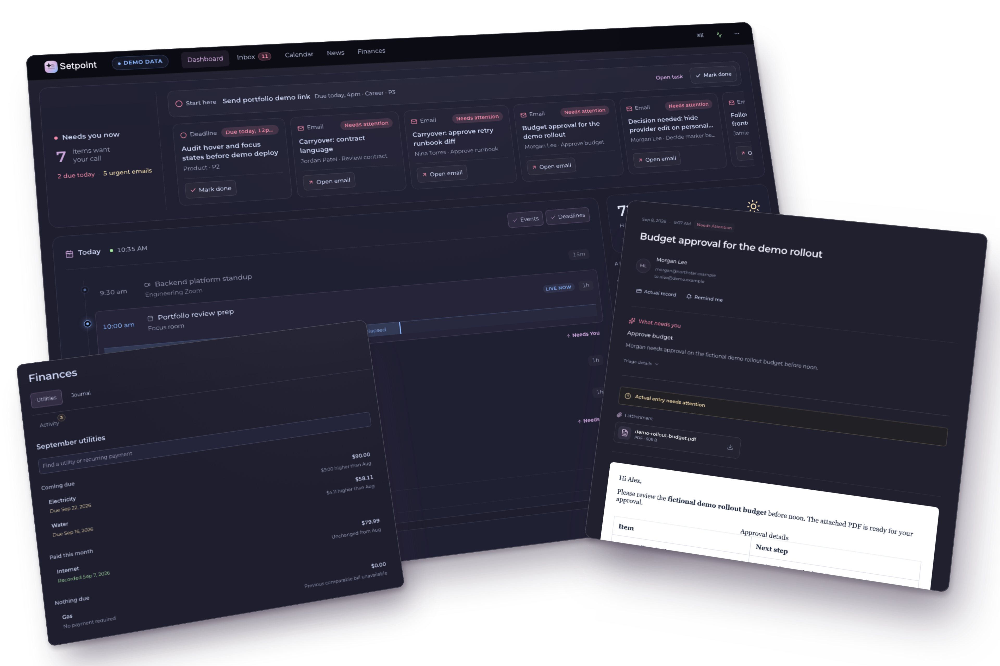

# Setpoint



A personal executive-assistant dashboard that consolidates email, calendar, tasks, reminders, weather, bills, and notes into one current operational view. It is built to solve the daily problem of managing multiple inboxes, calendars, tasks, and financial signals without losing important work in the noise.

Setpoint is a private BYOK system. Bring your own OpenAI or Anthropic API key: email triage and bill extraction can run on either provider, while semantic inbox search uses OpenAI embeddings and answer generation.

## Live Demo

<p align="center">
  <a href="https://ansidian.github.io/Setpoint/">
    
  </a>
  
  
</p>

The live demo is a static GitHub Pages build with rolling fictional data. It bypasses auth for the portfolio build and does not call the private backend, provider APIs, email accounts, calendars, Actual Budget, or AI services.

## What it does

The dashboard fetches data from multiple sources, continuously indexes incoming email, and maintains active inbox snapshots that surface what actually matters:

- **Email triage** — Pulls from multiple Gmail and iCloud accounts, classifies emails as actionable/FYI/noise, extracts urgency flags, and groups by account. The Settings page controls whether continuous triage runs real models, uses no-model local rules, or pauses job draining.
- **Semantic inbox search** — Searches the persisted email index with SQLite FTS5, OpenAI embeddings, and an Ask AI answer path over retrieved mail.
- **Bill detection and bill pay** — Extracts payee, amount, due date, and payment context from emails, resolves bill-pay mappings, and connects bill actions to Actual Budget.
- **Calendar workspace** — Aggregates Google Calendar events across connected accounts with event creation/editing, deadline and bill overlays, reminders, and a local search mirror for fast calendar search.
- **Todoist integration** — Syncs personal tasks, supports Todoist OAuth refresh and webhooks, creates/edits/deletes tasks, and preserves completed recurring occurrences long enough for the UI to stay stable.
- **Weather** — Shows current conditions and forecasts via Pirate Weather.
- **Continuous snapshots** — Indexes incoming mail and attaches it to active snapshot windows so the Inbox can update between scheduled boundaries.
- **Current data cache** — Caches boot-critical weather, calendar, deadline, bill, inbox, and provider-health data for graceful degradation.
- **Snapshot boundaries** — Cron-based schedule entries advance active email snapshot windows without running a batch generator.
- **Snapshot history** — Browses prior inbox snapshot windows from the current snapshot store.
- **Important senders and notifications** — Configures priority senders, browser notifications, triage notification sounds, and private Discord reminder delivery.
- **Notes and quick capture** — Keeps local operational notes beside the current dashboard view.
- **Multi-account support** — Supports multiple Gmail OAuth and iCloud IMAP accounts with custom labels, colors, and icons.
- **Operational controls** — Includes settings for provider credentials, model selection, account order, schedules, Actual Budget, Todoist, reminders, passkeys, and scoped API tokens.

## Tech stack

| Layer | Tech |
|-------|------|
| Frontend | React 19, Vite 8, React Router 7, Tailwind CSS 4 |
| UI | shadcn/ui, Radix, Framer Motion |
| Backend | Express.js (Node.js 24.x) |
| Database | Turso (LibSQL) |
| AI | BYOK Anthropic and OpenAI providers for email triage and bill extraction; OpenAI for semantic inbox search |
| Search | SQLite FTS5 email index, OpenAI embeddings, optional Turso/libSQL native vectors |
| Email | Gmail (OAuth 2.0), iCloud (IMAP) |
| Calendar | Google Calendar API |
| Weather | Pirate Weather API |
| Finances | Actual Budget API |
| Tasks | Todoist API |

For a detailed look at how everything fits together, see [ARCHITECTURE.md](ARCHITECTURE.md).

## Setup (BYOK)

This project requires your own API keys and credentials.

### Environment variables

```bash
# Optional legacy auth import for existing installations
# EA_PASSWORD_HASH=$2b$12$...
# EA_USER_ID=your-user-id

# WebAuthn passkeys. Production requires all three and must use your HTTPS app origin.
# Local dev defaults to Setpoint / localhost / http://localhost:5173 when unset.
EA_WEBAUTHN_RP_NAME=Setpoint
EA_WEBAUTHN_RP_ID=your-app-domain.com
EA_WEBAUTHN_ORIGIN=https://your-app-domain.com

# Database (Turso)
TURSO_DATABASE_URL=libsql://your-ea-db.turso.io
TURSO_AUTH_TOKEN=

# Encryption key for stored credentials (64-char hex)
EA_ENCRYPTION_KEY=

# Email AI providers (BYOK)
ANTHROPIC_API_KEY=

# OpenAI (enables OpenAI email AI, bill extraction, embeddings, and Ask AI)
OPENAI_API_KEY=

# Google OAuth (Gmail + Calendar)
GOOGLE_CLIENT_ID=
GOOGLE_CLIENT_SECRET=
GOOGLE_REDIRECT_URI=https://your-app.onrender.com/api/ea/accounts/gmail/callback
GMAIL_PUBSUB_TOPIC=projects/your-project/topics/gmail-push
GMAIL_PUBSUB_PUSH_TOKEN=long-random-webhook-token

# Todoist OAuth refresh + webhook verification
TODOIST_CLIENT_ID=todoist-developer-app-client-id
TODOIST_CLIENT_SECRET=todoist-developer-app-client-secret

# Pirate Weather (optional)
PIRATE_WEATHER_API_KEY=

# Startup workers (optional)
EA_STARTUP_WORKER_DELAY_MS=
EA_STARTUP_WORKER_JITTER_MS=
EA_STARTUP_INDEXER_OFFSET_MS=
EA_STARTUP_BACKFILL_OFFSET_MS=
EA_STARTUP_TODOIST_SYNC_OFFSET_MS=
EA_EMAIL_BACKFILL_QUEUE_ON_STARTUP=
```

In production, startup workers are delayed so the web server can accept the
first dashboard requests before catch-up jobs start. The default worker delay is
60-120 seconds, with an extra 2 minutes before the passive email indexer and an
extra 10 minutes before email backfill. Backfill only resumes interrupted jobs
on startup by default; set `EA_EMAIL_BACKFILL_QUEUE_ON_STARTUP=1` to queue a
new broad backfill automatically.

### Dashboard auth and passkey recovery

On a fresh database, open Setpoint after startup and create the owner password
in the browser. The first successful claim atomically creates the stable owner
ID, stores only the bcrypt password hash, signs that browser in, and permanently
closes public setup. Provider APIs and background workers remain disabled until
the claim succeeds. `GET /healthz` remains available for deployment readiness.

Existing installations may keep `EA_USER_ID` and `EA_PASSWORD_HASH`; startup
imports that exact legacy identity once. Partial or conflicting legacy auth
configuration fails closed instead of reopening public setup.

The private app accepts either the owner password or a registered WebAuthn
passkey by default. Registering a passkey does not disable password login.
Settings -> System can explicitly enable strict password-plus-passkey login;
identity and access changes require a password confirmation from the last ten
minutes.

Fresh owner claim displays eight one-time offline recovery codes. Setpoint
stores only their hashes and never returns them through normal Settings reads.
Using one code replaces the owner password, clears passkeys and pending auth,
revokes prior sessions, and displays a replacement recovery-code set once.

Production startup fails fast unless `EA_WEBAUTHN_RP_NAME`,
`EA_WEBAUTHN_RP_ID`, and `EA_WEBAUTHN_ORIGIN` are set. `EA_WEBAUTHN_RP_ID` is
the hostname only, not a URL. `EA_WEBAUTHN_ORIGIN` must be the HTTPS origin
served to the browser and must match the RP ID hostname.

If both normal sign-in and offline recovery are unavailable, use the local
operator reset script against the intended database:

```bash
npm run auth:reset-passkeys -- --dry-run
npm run auth:reset-passkeys -- --confirm
```

The reset clears registered passkeys, pending password-auth attempts, WebAuthn
challenges, and browser sessions. The next successful password login uses the
default password-or-passkey mode. Scoped API tokens are separate automation
credentials and do not grant dashboard login.

### Opt-in Turso semantic search verification

Normal `npm run dev` uses the local SQLite fallback and does not require Turso.
To test inbox Ask AI against Turso/libSQL native vectors, opt in explicitly:

```bash
npm run ai-search:embedding-status -- --adapter=turso
npm run ai-search:backfill -- --adapter=turso --limit=25
npm run dev:ai-search-turso
```

The Turso commands require `TURSO_DATABASE_URL`, `TURSO_AUTH_TOKEN`,
`EA_USER_ID`, and `OPENAI_API_KEY` when backfilling. `dev:ai-search-turso` sets
`AI_SEARCH_VECTOR_ADAPTER=turso` and disables the periodic embedding worker, so
semantic coverage changes only when you run an explicit bounded backfill.

### Todoist OAuth and webhook setup

The server uses `TODOIST_CLIENT_SECRET` to verify Todoist's
`X-Todoist-Hmac-SHA256` signature against the raw webhook body. It also uses
`TODOIST_CLIENT_ID` plus `TODOIST_CLIENT_SECRET` to refresh Todoist OAuth access
tokens before they expire.

In the Todoist Developer app console, configure the webhook callback URL to:

```text
https://your-app.onrender.com/api/todoist/webhook
```

Todoist requires webhook URLs to be HTTPS and to omit explicit ports. For local
testing, expose the Express server with a tunnel and use the tunnel HTTPS URL:

```text
https://<your-tunnel-host>/api/todoist/webhook
```

Todoist webhooks are tied to a Todoist app. For personal use, Todoist documents
that webhooks do not fire for the app creator by default; activate them by
completing that Todoist app's OAuth flow for your own account. Use scopes:

```text
data:read_write,data:delete
```

After exchanging the OAuth code for JSON containing `access_token`,
`refresh_token`, and `expires_in`, store that full JSON response through the
authenticated settings API. The app encrypts the access and refresh tokens,
tracks expiry, and refreshes before Todoist REST/Sync calls:

```bash
curl -X PUT "https://ea.andysu.tech/api/ea/settings" \
  -H "Content-Type: application/json" \
  -H "X-Requested-With: Setpoint" \
  -H "Cookie: ea_session=<your-session-cookie>" \
  --data-binary @- <<'JSON'
{
  "todoist_oauth_token_response": {
    "access_token": "...",
    "token_type": "Bearer",
    "expires_in": 3600,
    "refresh_token": "...",
    "scope": "data:read_write,data:delete"
  }
}
JSON
```

Existing long-lived personal Todoist tokens still work. Setting a personal token
through the Settings UI clears OAuth refresh metadata and uses personal-token
mode.

### Running locally

```bash
npm install
npm run dev        # runs both Vite (frontend) and Express (backend) concurrently
```

Frontend: `http://localhost:5173` — proxies `/api/*` to Express on port 3001.

By default, `email_triage_mode = auto` resolves to `no_model` outside production, so `npm run dev` can index and show incoming mail without spending model budget. Production `auto` resolves to `real`. Change the mode under Settings → System when you intentionally want real local triage or need to pause triage job draining.

### Production

```bash
npm run build      # Vite build → dist/
npm start          # Express serves dist/ + API routes
```

Database migrations run automatically on server start. The checked-in migration
set is a current-schema baseline for fresh databases; existing production
databases are expected to already contain the same current snapshot schema.

## License

[Creative Commons Attribution-NonCommercial 4.0 International (CC BY-NC 4.0)](https://creativecommons.org/licenses/by-nc/4.0/) — free to use and adapt for non-commercial purposes with attribution.
